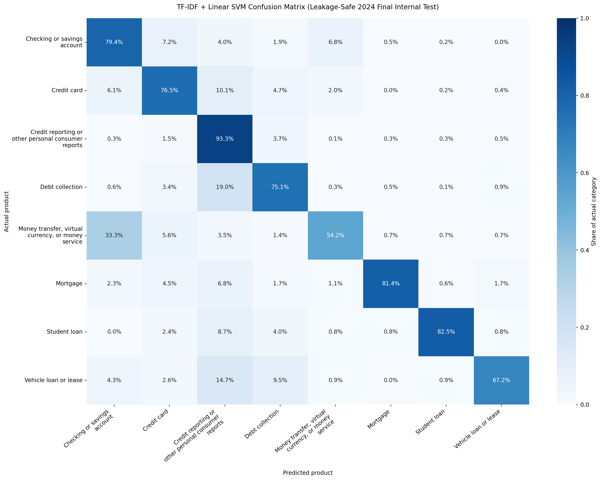
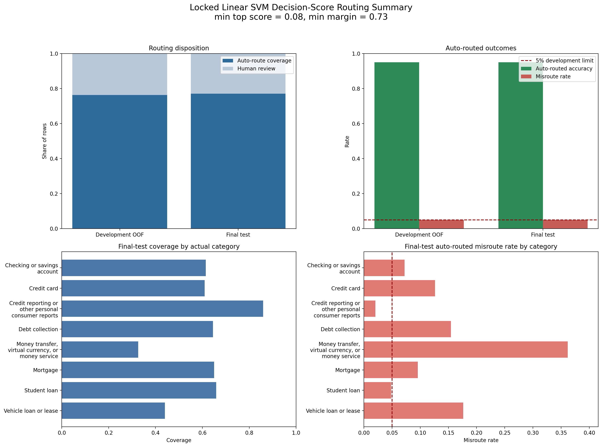
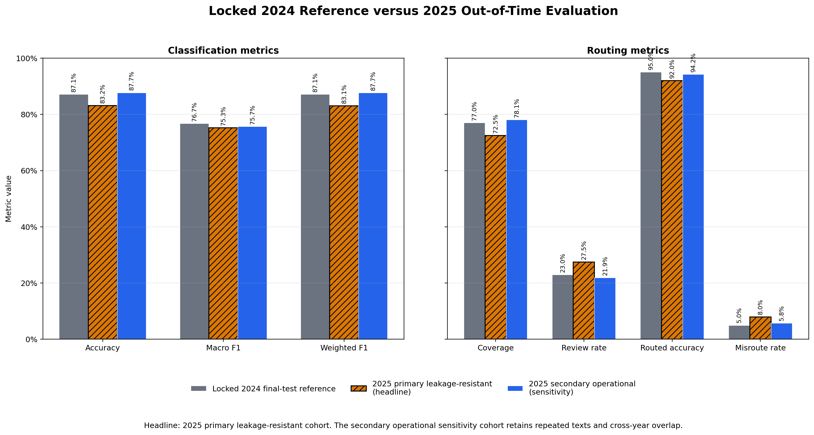

# Financial Complaint Auto-Routing with NLP

**Leakage-safe text classification and human-in-the-loop routing for public CFPB complaints**

## Project Overview

Financial institutions, fintech firms, and complaint operations teams receive written complaints that must be routed to the appropriate product team. Manual triage can be slow and inconsistent, while an incorrect automated route can delay review or create operational risk.

This repository implements an internal Version 1 NLP prototype that predicts one of eight CFPB product categories from a public consumer complaint narrative. The model predicts a product category, and a decision-score policy converts that prediction into either an automatic-routing recommendation or human review. It does not make legal or factual determinations and is not a deployed production service.

## Locked Version 1 and 2024 Reference at a Glance

| Item | Verified result |
| --- | --- |
| Data source | Public CFPB consumer complaint narratives |
| Input / target | `complaint_what_happened` narrative / `product` category |
| Development period | 2024 only |
| 2025 out-of-time sample | 50,000 raw rows; evaluated once under the committed locked protocol |
| Validated 2024 input sample | 50,000 rows |
| Rows after duplicate-leakage remediation | 33,042 |
| Development / final internal test | 26,433 / 6,609 |
| Product categories | 8 |
| Development/test normalized-text overlap | 0 groups |
| Selected model | TF-IDF + Linear SVM |
| Final internal-test accuracy | 0.8712 |
| Final internal-test Macro F1 | 0.7671 |
| Final internal-test Weighted F1 | 0.8715 |

These rows summarize the internal 2024 reference. The completed 2025 out-of-time results are reported separately below; neither evaluation establishes production readiness.

## Business Users and Workflow

The prototype is relevant to complaint intake, product operations, compliance operations, and risk analytics teams. It demonstrates this decision-support flow:

`Complaint narrative -> validation -> text preparation -> model recommendation -> routing rules -> automatic-route recommendation or human review -> aggregate reporting`

Human review remains central. The implemented routing rules assign complaints to review when either score threshold fails or model signals are tied, invalid, non-finite, or otherwise unusable. Higher-risk categories are not automatically assigned to review by the current code; a future business policy may add category-specific review controls.

### Potential Business Value

The prototype demonstrates how NLP-assisted routing could:

- support more consistent initial product-category recommendations;
- prioritize ambiguous or lower-signal complaints for human review; and
- provide aggregate visibility into routing coverage, review volume, and category-level risk.

These are demonstrated analytical capabilities, not claims of realized workload reduction, cost savings, or production impact.

## Completed Technical Approach

1. Acquired and validated a monthly-balanced, daily-stratified 2024 CFPB sample, then applied light text cleaning.
2. Completed aggregate EDA, label review, and missing-value, outlier, duplicate, and conflict audits.
3. Removed conflicting-label text groups, retained one representative from each repeated same-label group, and used group-aware splitting to prevent normalized-text leakage.
4. Compared TF-IDF pipelines with Logistic Regression, Multinomial Naive Bayes, and Linear SVM, selecting Linear SVM through development-only cross-validation.
5. Evaluated the locked model once on the 6,609-row 2024 final internal test, with zero normalized-text overlap between the development and final-test partitions.
6. Selected score and margin thresholds from development out-of-fold results, then tested the human-review routing policy on the final internal test.
7. Precommitted the 2025 validation protocol, reproduced the 2024 reference gate, and evaluated the unchanged workflow for out-of-time classification, routing, and drift.

### Model Comparison

| Model | Development CV Macro F1 |
| --- | ---: |
| TF-IDF + Logistic Regression | 0.7430 |
| TF-IDF + Multinomial Naive Bayes | 0.3519 |
| **TF-IDF + Linear SVM** | **0.7687** |

Values are five-fold group-aware development cross-validation means. Macro F1 was the primary selection metric because the eight categories are imbalanced.

## Leakage-Safe Evaluation

The original row-level split allowed 3,876 of 9,840 test rows (39.39%) to share normalized text with training. Those earlier results are superseded. The corrected workflow:

- excludes normalized-text groups that have conflicting product labels;
- retains one row from repeated same-label normalized-text groups;
- keeps normalized-text groups intact during splitting and cross-validation; and
- confirms zero normalized-text overlap between development and final internal test data.

The corrected confusion matrix and detailed reports are available here:

- [Row-normalized confusion matrix](reports/figures/confusion_matrix.png)
- [Technical results summary](reports/results_summary.md)
- [Aggregate error analysis](reports/error_analysis.md)
- [Completed Version 1 model card](reports/model_card.md)

The figure below shows where the locked 2024 classifier distinguishes categories well and where category confusion remains.

### Additional Data and EDA Evidence

- [Data preparation proof](reports/figures/data_preparation_proof.png)
- [Product distribution chart](reports/figures/product_distribution.png)
- [Text-length distribution chart](reports/figures/text_length_distribution.png)

## Human-in-the-Loop Routing

Linear SVM produces decision scores, not calibrated probabilities. The routing analysis uses two signals:

| Locked rule | Threshold |
| --- | ---: |
| Minimum top decision score | 0.08 |
| Minimum top-two score margin | 0.73 |

Both thresholds must pass for an automatic-routing recommendation. Otherwise, the complaint is assigned to human review.

| Final-test routing metric | Result |
| --- | ---: |
| Auto-routing coverage | 0.7705 (77.05%) |
| Human-review rate | 0.2295 (22.95%) |
| Auto-routed accuracy | 0.9503 (95.03%) |
| Auto-routed misroute rate | 0.0497 (4.97%) |

The aggregate 4.97% misroute rate does not mean every category remained below 5%. Money transfer/virtual currency/money service, Vehicle loan or lease, Debt collection, and Credit card showed higher observed category-level routing risk. Several of these categories also have small auto-routed counts, so their estimates are less stable.

- [Routing decision-score summary](reports/figures/routing_decision_score_summary.png)

The figure below shows how the locked routing policy balances automatic-routing coverage, human review, and category-level misroute risk on the 2024 final internal test.

The 5% development misroute rule is a project assumption, not a stakeholder-approved or production-validated risk limit. The results demonstrate selective routing behavior; they do not guarantee workload reduction in an operating environment.

## 2025 Out-of-Time Validation

**Headline finding:** The locked workflow remained useful, but classification and routing performance weakened on the stricter 2025 leakage-resistant cohort.

The one-time 2025 evaluation kept the fitted model, preprocessing, eight-category scope, `classes_` order, cohort rules, metrics, and routing thresholds fixed. The locked 6,609-row 2024 final internal test remains the reference. The 30,156-row primary leakage-resistant cohort is the headline 2025 result; it excludes normalized-text overlap with either 2024 partition, removes conflicting-label groups, and retains one row per remaining repeated same-label text. The 49,225-row secondary operational cohort retains repeated texts and cross-year overlap and is reported only as a sensitivity view.

| Cohort | Rows | Accuracy | Macro F1 | Weighted F1 | Routing coverage | Review rate | Routed accuracy | Misroute rate |
| --- | ---: | ---: | ---: | ---: | ---: | ---: | ---: | ---: |
| Locked 2024 final internal test | 6,609 | 0.8712 | 0.7671 | 0.8715 | 0.7705 | 0.2295 | 0.9503 | 0.0497 |
| **2025 primary leakage-resistant** | **30,156** | **0.8315** | **0.7527** | **0.8306** | **0.7251** | **0.2749** | **0.9203** | **0.0797** |
| 2025 secondary sensitivity | 49,225 | 0.8771 | 0.7569 | 0.8766 | 0.7809 | 0.2191 | 0.9424 | 0.0576 |

Against the locked 2024 reference, the headline primary result decreased by 0.0397 in accuracy, 0.0145 in Macro F1, 0.0408 in Weighted F1, 0.0453 in routing coverage, and 0.0300 in routed accuracy. Its review rate increased by 0.0453 and its misroute rate increased by 0.0300. Generalization therefore weakened on the leakage-resistant 2025 cohort. The more favorable secondary result does not replace that conclusion because its repeated texts and cross-year overlap make it a different sensitivity cohort.

- [Complete 2025 holdout results](reports/2025_holdout_results.md)
- [2025 primary confusion matrix](reports/figures/2025_confusion_matrix.png)
- [2024-versus-2025 comparison](reports/figures/2024_vs_2025_comparison.png)

The figure below compares whether the locked 2024 classification and routing results carried forward to the two 2025 evaluation cohorts.

The 2025 sample is no longer an untouched, unbiased holdout. It was not used to fit, tune, calibrate, or select the model or thresholds, and it must not be reused for those purposes. Any future model or policy change requires a new untouched validation period.

## Tech Stack

- Python, Pandas, NumPy, and Requests
- Jupyter Notebook
- Scikit-learn pipelines and TF-IDF
- Logistic Regression, Multinomial Naive Bayes, and Linear SVM
- Matplotlib and Seaborn
- `unittest` routing-rule tests
- Git, GitHub, and GitHub Actions
- CFPB Consumer Complaint Database API

CI validates Python syntax, core imports, and routing-rule unit tests. It does
not execute the data-dependent notebooks, retrain the classifier, or reproduce
the local model artifact.

## Reproduce the Workflow

1. Use Python 3.11 and install the listed dependencies with `python -m pip install -r requirements.txt`.
2. Run Notebooks 01 through 05 in numerical order, then run Notebook 07 for the locked out-of-time validation. Notebook 06 is a standalone course-submission notebook.
3. Keep raw and processed CSV files and fitted model artifacts local and Git-ignored.
4. Use the exact locked environment documented in `reports/2025_validation_protocol.md` for Notebook 07.

The unpinned `requirements.txt` supports setup but does not guarantee exact compatibility with the saved model artifact.

## Current Status

Completed:

- 2024 ingestion, cleaning, EDA, leakage remediation, and group-aware model selection
- locked 2024 internal classification and decision-score routing evaluation
- tested routing-rule logic and aggregate model documentation
- precommitted holdout protocol and reproducible 2024 entry gate
- locked 2025 classification, routing, drift, and cohort-sensitivity evaluation

Not implemented or approved:

- deployed prediction API or batch-scoring service
- operational dashboard or review queue
- production monitoring, secure storage, and audit logging
- scheduled retraining
- privacy, security, compliance, governance, or stakeholder approval

The fitted pipeline remains a local, Git-ignored artifact at `models/best_tfidf_classifier.joblib`; no operational inference service is included.

## Limitations

- The evaluations use sampled 2024 and 2025 CFPB data, not institution-specific intake data or the complete operational population.
- Within each daily sampling window, CFPB API pagination may still reflect API sort order rather than fully random selection.
- Public narratives and historical CFPB labels may contain ambiguity, label noise, and selection bias.
- The dominant credit-reporting category strongly influences weighted metrics.
- Smaller categories have lower support and less stable estimates.
- Exact normalized-text hashing does not detect paraphrased near-duplicates.
- Linear SVM decision scores and margins are not calibrated probabilities.
- Routing thresholds are project assumptions and have not received production or stakeholder approval.
- No fairness evaluation, probability calibration, operational workload study, or production monitoring result is claimed.
- Complaint narratives may contain sensitive information; any operational use would require stronger privacy controls, access restrictions, retention rules, and governance.
- The one-time 2025 sample has been evaluated and is no longer an untouched holdout; future changes require a new untouched validation period.
- The 2025 headline primary result showed weaker classification and routing performance than the locked 2024 reference.

## Roadmap

1. Preserve the completed 2025 evaluation as a one-time generalization assessment and use a new untouched period for any future model or policy change.
2. Review category-specific error costs and routing thresholds with operational stakeholders without tuning against the exhausted 2025 holdout.
3. Evaluate probability calibration and refine category-specific human-review policies using development data and a newly protected validation design.
4. Add privacy, security, fairness, explainability, monitoring, and drift controls before any production consideration.
5. Compare DistilBERT with the locked Version 1 baseline as future work under new leakage-safe development and validation boundaries.
6. Design production APIs, dashboards, storage, retraining, and governance only after further validation and approval.

## Repository Guide

| Path | Purpose |
| --- | --- |
| `notebooks/01_data_download.ipynb` | Local-first CFPB data acquisition and validation |
| `notebooks/02_eda_cleaning.ipynb` | Text cleaning and target preparation |
| `notebooks/03_data_quality_product_distribution.ipynb` | Data-quality and distribution analysis |
| `notebooks/04_sklearn_baseline_model.ipynb` | Leakage-safe comparison, selection, and final Version 1 evaluation |
| `notebooks/05_decision_score_routing.ipynb` | Development OOF threshold selection and final-test routing analysis |
| `notebooks/06_final_project_submission.ipynb` | Standalone course submission notebook |
| `notebooks/07_2025_out_of_time_validation.ipynb` | Locked 2024 reproduction gate and 2025 out-of-time evaluation |
| `reports/2025_validation_protocol.md` | Precommitted two-phase holdout protocol |
| `reports/2025_holdout_results.md` | Detailed 2025 cohort, classification, routing, and drift results |
| `reports/figures/2025_confusion_matrix.png` | Primary 2025 row-normalized confusion matrix |
| `reports/figures/2024_vs_2025_comparison.png` | Aggregate reference and cohort comparison |
| `reports/results_summary.md` | Verified 2024 reference and 2025 out-of-time results |
| `reports/model_card.md` | Intended use, limitations, oversight, and monitoring guidance |
| `docs/system_design.md` | Completed prototype components and future architecture |
| `docs/portfolio_summary.md` | Portfolio description and resume-ready bullets |
| `src/routing_rules.py` | Tested routing decision logic |
| `tests/test_routing_rules.py` | Routing boundary, validation, and class-order tests |

Raw and processed CSV files, complaint narratives, row-level predictions, and fitted model artifacts remain local and Git-ignored.

## Documentation

- [Complete Project Report (PDF)](Financial_Complaint_Auto_Routing_NLP_Project_Report.pdf)
- [Business case](docs/business_case.md)
- [Data decisions and quality notes](docs/data_decisions.md)
- [Data-ingestion design](docs/data_ingestion.md)
- [Modeling plan and completed Version 1 workflow](docs/modeling_plan.md)
- [System design](docs/system_design.md)
- [Portfolio summary](docs/portfolio_summary.md)
