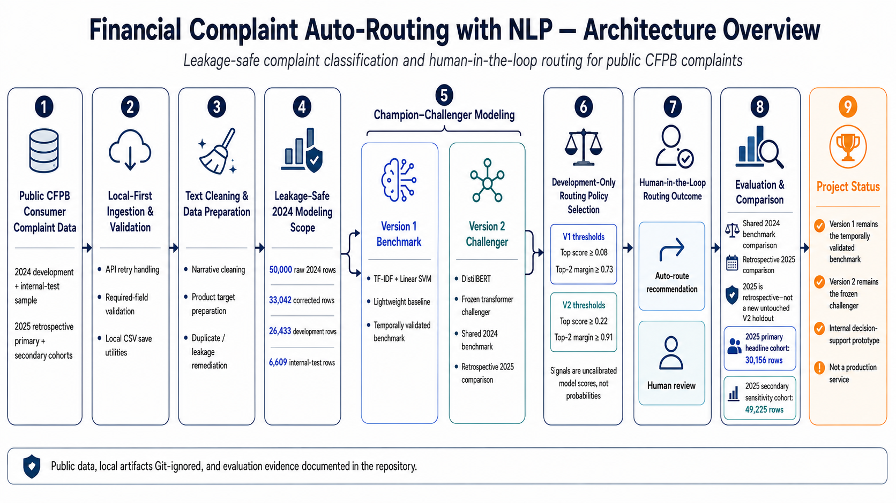
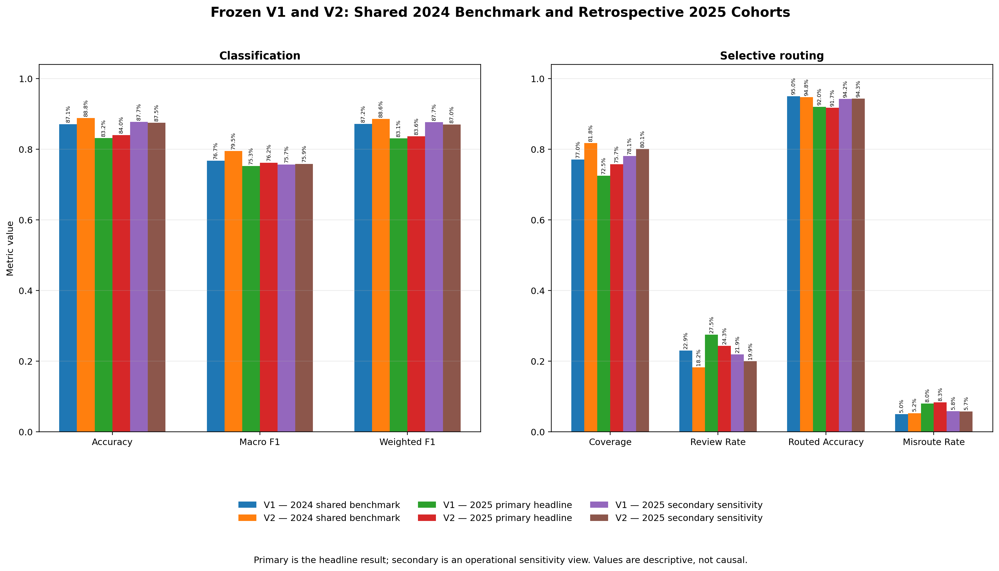

# Financial Complaint Auto-Routing with NLP

**Leakage-safe text classification and human-in-the-loop routing for public CFPB complaints**

## Project Overview

Financial institutions, fintech firms, and complaint operations teams must route written complaints to the right product team. This applied NLP and Data Science project frames that task as an eight-class classification problem using public CFPB complaint narratives, while preserving a Human Review path for uncertain recommendations.

The offline decision-support prototype compares a TF-IDF + Linear SVM Version 1 benchmark with a frozen DistilBERT Version 2 challenger. Each model uses its own development-selected routing policy to return either an Auto-Route recommendation or Human Review. Neither model makes legal or factual determinations, and the repository is not a deployed complaint-routing service.

**Final outcome:** Retain Version 1 as the temporally validated benchmark. Version 2 improved aggregate classification and coverage, but remains a frozen challenger pending evidence from a new untouched future period.

## Key Results

- **Leakage audit:** 3,876 of 9,840 original test rows (39.39%) overlapped training; corrected group-aware evaluation reduced development/final-test normalized-text overlap to zero.
- **Shared 2024 benchmark:** DistilBERT improved Macro F1 from 0.7671 to 0.7949 and routing coverage from 77.05% to 81.77%.
- **Selective routing:** Version 1 achieved 95.03% routed accuracy at 77.05% coverage on the locked 2024 final internal test.
- **Temporal evidence:** Both frozen models weakened on the stricter 30,156-row 2025 leakage-resistant primary cohort.
- **Decision:** Version 1 remains the temporally validated benchmark; Version 2 remains a frozen challenger until a new untouched period supports promotion.

## Evaluation at a Glance

| Item | Locked scope |
| --- | --- |
| Data | Sampled public CFPB consumer complaint narratives |
| Prediction task | Eight product categories |
| Version 1 | TF-IDF + Linear SVM benchmark |
| Version 2 | Frozen DistilBERT challenger |
| 2024 development / final test | 26,433 / 6,609 rows |
| Leakage boundary | Group-aware; zero normalized-text overlap |
| 2025 headline evidence | 30,156-row primary leakage-resistant cohort |
| Decision output | Auto-Route recommendation or Human Review |

## Architecture

Public CFPB complaint data flows through leakage-safe preparation, parallel V1/V2 modeling, model-specific selective-routing rules, an Auto-Route recommendation or Human Review, and matched and temporal evaluation.

## Business Problem and Workflow

The prototype supports complaint intake, product operations, compliance operations, and risk analytics with this decision-support flow:

`Complaint narrative -> validation -> text preparation -> model recommendation -> routing policy -> Auto-Route recommendation or Human Review -> aggregate evaluation`

Human Review is intentional: tied, invalid, non-finite, or below-threshold model signals make a case ineligible for an Auto-Route recommendation.

**Potential decision-support value:** improve routing consistency for clear cases, direct ambiguous complaints to Human Review, and expose category-level routing risk for operational review. These are potential capabilities, not claims of realized workload reduction, cost savings, or production impact.

## Technical Approach

1. **Data acquisition and quality audit:** build and validate a sampled 2024 CFPB narrative dataset across eight product categories.
2. **Leakage remediation and evaluation design:** remove conflicts and repeated texts, then keep normalized-text groups intact in splitting and cross-validation.
3. **Classical ML benchmark:** compare TF-IDF pipelines with Logistic Regression, Multinomial Naive Bayes, and Linear SVM; select Linear SVM using development-only group-aware Macro F1.
4. **Human-in-the-loop routing:** select two-threshold policies from development out-of-fold signals and evaluate coverage, review volume, routed accuracy, and misroutes.
5. **Frozen transformer challenger:** train DistilBERT on the locked 2024 development boundary, then compare frozen V1/V2 models on the shared 2024 benchmark and retrospectively on the existing 2025 cohorts.

| Version 1 development comparison | Group-aware CV Macro F1 |
| --- | ---: |
| TF-IDF + Logistic Regression | 0.7430 |
| TF-IDF + Multinomial Naive Bayes | 0.3519 |
| **TF-IDF + Linear SVM** | **0.7687** |

These are five-fold development cross-validation means. Macro F1 was the selection metric because the categories are imbalanced.

Implementation details and notebook-level evidence are available in the [Repository Guide](#repository-guide) and [Documentation and Evidence](#documentation-and-evidence).

## Leakage-Safe Evaluation

The original row-level split was invalid because 3,876 of 9,840 test rows (39.39%) shared normalized text with training; those earlier results are superseded. The corrected workflow:

- excludes normalized-text groups with conflicting product labels;
- retains one representative from repeated same-label groups;
- keeps groups intact during splitting and cross-validation; and
- produces 26,433 development rows and 6,609 final-test rows with zero normalized-text overlap.

The corrected confusion matrix preserves the category-level error evidence behind the locked 2024 results. See the [technical results summary](reports/results_summary.md) and [aggregate error analysis](reports/error_analysis.md) for the full audit and metrics.

## Human-in-the-Loop Routing

Version 1 uses Linear SVM decision scores—not calibrated probabilities—and requires both locked thresholds to pass for an Auto-Route recommendation:

| Version 1 routing rule | Threshold |
| --- | ---: |
| Minimum top decision score | 0.08 |
| Minimum top-two score margin | 0.73 |

| Locked 2024 final-test metric | Result |
| --- | ---: |
| Routing coverage | 77.05% |
| Human Review rate | 22.95% |
| Routed accuracy | 95.03% |
| Aggregate routed misroute rate | 4.97% |

The aggregate 4.97% misroute rate **does not mean every class remained below 5%**. Several categories showed higher observed risk, and smaller routed groups have less-stable estimates. The 5% development rule is a project assumption—not a stakeholder-approved or production-validated threshold. [Inspect the routing evidence.](reports/figures/routing_decision_score_summary.png)

## Version 1 vs. Version 2

| Decision evidence | V1 | V2 | Interpretation |
| --- | ---: | ---: | --- |
| 2024 Macro F1 | 0.7671 | 0.7949 | V2 higher |
| 2024 routing coverage | 77.05% | 81.77% | V2 broader |
| 2024 misroute rate | 4.97% | 5.24% | V1 slightly lower |
| 2025 primary Macro F1 | 0.7527 | 0.7620 | V2 modestly higher |
| 2025 primary misroute rate | 7.97% | 8.26% | No routing-risk advantage |

Version 2 improved aggregate classification and coverage, but did not establish a clear routed-risk or operational advantage.

The shared 2024 comparison is a matched benchmark—not a new untouched V2 holdout—and the 2025 comparison is retrospective because Version 1 had already used that sample. Version 1 therefore remains the benchmark and Version 2 remains the frozen challenger.

- [Shared 2024 V1-versus-V2 comparison](reports/v1_v2_2024_comparison.md)
- [Retrospective 2025 V1-versus-V2 results](reports/v2_2025_retrospective_results.md)
- [Version 2 model card](reports/v2_model_card.md)

## Temporal Validation

| Version 1 evidence | Rows | Macro F1 | Coverage | Routed accuracy | Misroute rate |
| --- | ---: | ---: | ---: | ---: | ---: |
| Locked 2024 final internal test | 6,609 | 0.7671 | 77.05% | 95.03% | 4.97% |
| **2025 primary leakage-resistant** | **30,156** | **0.7527** | **72.51%** | **92.03%** | **7.97%** |
| 2025 secondary sensitivity | 49,225 | 0.7569 | 78.09% | 94.24% | 5.76% |

Performance weakened on the primary 2025 cohort, which excludes overlap with both 2024 partitions, removes conflicting-label groups, and retains one row per repeated same-label text.

The 49,225-row secondary cohort retains repeated texts and cross-year overlap, so it is sensitivity evidence only. The 2025 sample can no longer serve as an untouched holdout; any future model or policy change requires a **new untouched validation period**. See the [2025 protocol](reports/2025_validation_protocol.md) and [complete temporal results](reports/2025_holdout_results.md).

## Tech Stack

- **Data and analysis:** Python, Pandas, NumPy, SciPy, CFPB API
- **Classical ML:** scikit-learn, TF-IDF, Logistic Regression, Multinomial Naive Bayes, Linear SVM
- **Transformer NLP:** PyTorch, Transformers, DistilBERT
- **Evaluation:** group-aware cross-validation, temporal validation, selective routing, error analysis
- **Visualization:** Matplotlib, Seaborn
- **Engineering:** Git, GitHub Actions, `unittest`

CI installs the pinned Version 1 requirements, checks syntax and imports, and runs mocked ingestion and routing-rule tests. It does not execute data-dependent notebooks, retrain either model, or reproduce local model artifacts.

## Reproduce

1. Use Python 3.11.15 and install Version 1 dependencies with `python -m pip install -r requirements.txt`.
2. Run Notebooks 01–05 in order, then Notebook 07 for locked temporal validation; Notebook 06 is the standalone course-submission notebook.
3. For Version 2, create a separate environment from `requirements-v2.txt` and run Notebooks 08–11 in order.
4. Keep raw and processed data plus fitted/frozen model artifacts local and Git-ignored; Notebooks 10–11 require the local artifact created by Notebook 09.
5. Use the exact locked environment in the [2025 validation protocol](reports/2025_validation_protocol.md) when reproducing Notebook 07.

`requirements.txt` records the validated Version 1 Python 3.11.15 environment; `requirements-v2.txt` pins the separate Version 2 environment. Exact pins improve reproducibility but do not guarantee identical behavior across operating systems or hardware.

## Project Status

**Completed:** leakage-safe V1 benchmark, selective-routing evaluation, 2025 temporal validation, frozen DistilBERT challenger, and matched V1/V2 evaluation.

**Scope:** offline decision-support research prototype. No deployed prediction API, operational review queue, production monitoring, automated retraining, or stakeholder-approved operating policy is included. Local data and fitted model artifacts remain Git-ignored.

## Limitations

- Results use sampled public CFPB data rather than institution-specific intake or the complete operational population; daily API pagination may introduce sampling effects.
- Historical narratives and labels may include ambiguity, selection bias, and label noise; exact normalized-text matching does not detect paraphrased near-duplicates.
- Class imbalance favors the dominant credit-reporting category in weighted metrics, while smaller categories and routed subsets yield less-stable estimates.
- V1 decision scores and V2 softmax scores and margins are uncalibrated signals; V2 also truncates a material share of narratives at 256 tokens, and both routing policies use project-defined rather than stakeholder-approved thresholds.
- Operational use would require privacy, security, fairness, monitoring, access, retention, audit, compliance, and governance controls that this offline prototype does not implement.
- The primary 2025 evidence weakened versus 2024 and is now exhausted as unbiased validation evidence; future changes require a new untouched period.

## Roadmap

1. Evaluate both frozen models and policies on a new untouched future period.
2. Validate calibration and category-specific Human Review and risk policies with operational stakeholders under a newly protected evaluation design.
3. Address privacy, security, monitoring, governance, and production architecture only after stronger independent evidence.

## Repository Guide

| Area | Purpose |
| --- | --- |
| `notebooks/01–07` | V1 data, modeling, routing, and temporal validation |
| `notebooks/08–11` | DistilBERT challenger and V1/V2 comparison |
| `src/` | Reusable ingestion and routing logic |
| `tests/` | Mocked ingestion and routing-rule tests |
| `reports/` | Evaluation results, figures, protocols, and model cards |
| `docs/` | Business context, methodology, system design, and portfolio notes |
| `requirements.txt` / `requirements-v2.txt` | Separate pinned V1 and V2 environments |

Raw and processed CSV files, complaint narratives, row-level predictions, and fitted model artifacts remain local and Git-ignored.

## Documentation and Evidence

- [Complete Project Report (PDF)](./Complaint_Routing_NLP_Report.pdf)
- [Business case](docs/business_case.md) and [modeling methodology](docs/modeling_plan.md)
- [2024 and 2025 results summary](reports/results_summary.md)
- [2025 temporal evaluation](reports/2025_holdout_results.md)
- [Shared 2024 and retrospective 2025 V1/V2 comparison](reports/v1_v2_2024_comparison.md) ([2025 results](reports/v2_2025_retrospective_results.md))
- [Version 1 model card](reports/model_card.md)
- [Version 2 model card](reports/v2_model_card.md)
- [System design](docs/system_design.md)
