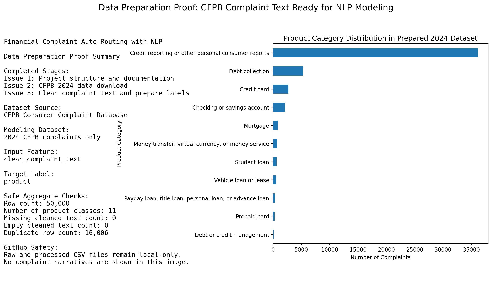

# Financial Complaint Auto-Routing with NLP

**AI/NLP Business Solution for Complaint Routing and Human Review**

[](https://github.com/rihua-tech/financial-complaint-auto-routing-nlp/actions/workflows/ci.yml)

This project is a business-oriented AI/NLP solution that uses public CFPB consumer complaint narratives to classify financial complaints into product categories and support faster, more consistent routing decisions.

`Business problem -> data ingestion -> NLP model -> evaluation -> routing recommendation -> human review`

## Project Highlights

- AI/NLP business solution for financial complaint auto-routing.
- Uses CFPB consumer complaint narratives as text input and product category as the target label.
- Builds separate 2024 and 2025 datasets for realistic model development and future holdout testing.
- Uses monthly-balanced + daily-stratified data ingestion to reduce recency bias.
- Demonstrates data ingestion, validation, sampling design, ML workflow planning, and business routing design.
- Plans Scikit-learn TF-IDF baseline models before future DistilBERT experimentation.
- Plans confidence-based routing logic with human review for low-confidence cases.
- Keeps raw complaint CSV files local-only and ignored by Git.

## Business Problem

Financial institutions, fintech companies, customer support teams, and compliance groups receive large volumes of written complaints. Manual triage can be slow, inconsistent, and difficult to scale when complaints need to be routed across mortgage, credit card, bank account, debt collection, credit reporting, or loan servicing teams.

This project simulates an NLP-assisted routing workflow that predicts a complaint product category from the consumer narrative.

## Business Users and Value

Target users include complaint operations teams, compliance teams, product operations teams, and risk analytics teams that need faster and more consistent complaint triage.

The planned solution is designed to support:

- Faster initial routing for routine complaint cases.
- More consistent product-category recommendations.
- Reduced manual review effort for high-confidence predictions.
- Human review for low-confidence, ambiguous, or higher-risk complaints.
- Better reporting on complaint volume, model performance, and review workload.

## Solution Approach

The project is organized as an AI/NLP business solution workflow:

`Complaint text -> data validation -> NLP model -> evaluation -> confidence-based routing -> human review -> reporting deliverables`

The solution framework has three layers:

1. **Data workflow**: Download and validate public CFPB complaint records, then prepare complaint narratives and product labels for analysis.
2. **Model workflow**: Build and evaluate baseline NLP classifiers using TF-IDF features and Scikit-learn models.
3. **Business workflow**: Convert model predictions into routing recommendations using confidence thresholds, human review rules, and reporting templates.

No trained model artifacts, model scores, confusion matrices, routing-confidence outputs, or production readiness claims are included yet.

## Tech Stack

- Python
- Pandas
- Requests
- Jupyter Notebook
- Scikit-learn
- TF-IDF
- GitHub Actions
- CFPB API

Scikit-learn and TF-IDF are part of the planned baseline modeling workflow. The current completed work is focused on project setup, documentation, CFPB data ingestion, validation, and Week 3 text-cleaning/label-preparation.

## Current Status

- Week 1 setup: completed.
- Week 2 CFPB raw data download and validation: completed.
- Dataset sampling upgrade: separate 2024 and 2025 monthly-balanced + daily-stratified samples completed locally.
- Business solution framework documentation: added as a project structure update.
- Week 3 text cleaning and target label preparation: completed.
- Week 4 EDA and product category exploration: next step.
- Version 1 Scikit-learn baseline: planned.
- Version 2 DistilBERT transformer upgrade: future work.

No trained model scores, confusion matrices, routing-confidence results, or completed model evaluation results are reported yet.

## Current Project Proof

The project has completed the setup, CFPB data download, and Week 3 text-cleaning/label-preparation stages. The image below shows an aggregate-only proof summary for the prepared 2024 CFPB modeling dataset.



## Dataset Design Summary

Dataset source: Consumer Financial Protection Bureau (CFPB) Consumer Complaint Database.

The project uses complaint records with public consumer complaint narratives from the CFPB API.

- Input text column: `complaint_what_happened`
- Target label column: `product`

| Dataset | Purpose | Rows | Date range | Notes |
| --- | ---: | ---: | --- | --- |
| 2024 CFPB sample | Model development | 50,000 | 2024-01-01 to 2024-12-31 | Future train/validation/internal test |
| 2025 CFPB sample | Future holdout | 50,000 | 2025-01-01 to 2025-12-31 | Out-of-time validation |

Detailed monthly and daily validation results are documented in `docs/data_ingestion.md`.

## Repository Structure

```text
.
|-- assets/                         # Placeholder for future diagrams or presentation assets
|-- data/
|   |-- raw/                        # Local-only raw CFPB data, ignored except .gitkeep
|   `-- processed/                  # Local-only processed data, ignored except .gitkeep
|-- docs/
|   |-- business_case.md            # Business problem, users, workflow, and limitations
|   |-- data_ingestion.md           # CFPB data-ingestion design and validation details
|   |-- modeling_plan.md            # Planned modeling and evaluation approach
|   `-- system_design.md            # Architecture and data flow
|-- models/                         # Local-only model artifacts, ignored except .gitkeep
|-- notebooks/
|   |-- 01_data_download.ipynb      # 2024/2025 CFPB raw data download and validation workflow
|   |-- 02_eda_cleaning.ipynb       # Week 3 text cleaning and target-label preparation
|   `-- 03_sklearn_baseline_model.ipynb # Planned Scikit-learn baseline modeling
|-- reports/
|   |-- figures/
|   |   `-- data_preparation_proof.png # Aggregate-only Week 3 data-preparation proof
|   |-- error_analysis.md           # Template, pending model evaluation
|   |-- model_card.md               # Template, pending model evaluation
|   `-- results_summary.md          # Template, pending model evaluation
|-- src/
|   |-- clean_text.py               # Placeholder for text cleaning utilities
|   |-- download_data.py            # Reusable CFPB sampling, validation, and raw CSV helper functions
|   |-- predict.py                  # Lightweight prediction interface placeholder
|   |-- routing_rules.py            # Lightweight routing policy placeholder
|   `-- train_baseline.py           # Placeholder for baseline training utilities
|-- requirements.txt
`-- README.md
```

## Data Safety Notes

- Raw CFPB CSV files are local-only and ignored by Git.
- Processed data and model artifacts are local-only.
- Do not upload raw complaint files or complaint narrative examples to GitHub.

Longer ingestion and raw-data handling notes are documented in `docs/data_ingestion.md`.

## Roadmap / Next Steps

- Complete Week 4 EDA and product category exploration on the 2024 model-development dataset.
- Build TF-IDF + Scikit-learn baseline models.
- Evaluate with accuracy, macro F1, weighted F1, and per-class metrics.
- Add confidence-based routing and human review rules.
- Use 2025 only for future out-of-time validation after model selection.
- Consider DistilBERT only after baseline results are documented.


## Limitations

- The 2024 and 2025 datasets are sampled from the CFPB database, not the full CFPB database.
- Within each daily window, CFPB API pagination may still reflect the API sort order rather than fully random selection.
- The 2025 dataset is reserved for future out-of-time validation and should not be used for model training or model selection.
- Complaint narratives can be sensitive, even when sourced from public data, so any production workflow would require stronger privacy, access control, monitoring, and governance.
- Automated routing should support human review, not replace it, especially for low-confidence, ambiguous, regulated, or high-risk complaints.
