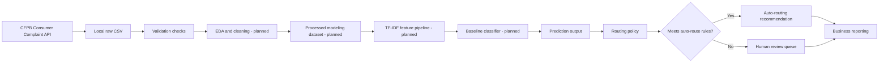

# System Design

## High-Level Architecture

The planned solution has five logical layers:

1. **Data ingestion**: Download public CFPB complaint data locally.
2. **Data preparation**: Validate required fields, clean narrative text, and prepare labels.
3. **Modeling**: Train baseline NLP classifiers and save evaluation outputs.
4. **Routing decision**: Convert predictions into auto-route or human-review recommendations.
5. **Reporting**: Summarize model performance, error patterns, and business routing metrics.

The current repository contains completed setup/data-ingestion work, documentation, report templates, and lightweight routing placeholders. Model training and evaluation are planned.

## Data Flow

## Component Responsibilities

### Data Ingestion

The data-ingestion workflow downloads public CFPB complaint records to `data/raw/`. Raw CSV files are local only and ignored by Git. The current Week 2 workflow has already completed the raw download and validation snapshot.

### Data Preparation

Week 3 EDA and cleaning are planned but not continued in this branch. Planned preparation includes:

- Validate narrative and target-label fields.
- Remove or handle unusable records based on documented rules.
- Clean text for baseline modeling.
- Create a processed modeling dataset locally, without committing CSV files.

### Modeling

The planned baseline modeling workflow uses:

- TF-IDF vectorization.
- Logistic Regression.
- Naive Bayes.
- Linear SVM.

Model artifacts are expected to remain local and ignored by Git unless a future governance decision changes that policy.

### Prediction Interface

`src/predict.py` provides a placeholder interface for future prediction code. It intentionally does not assume that a trained model exists.

### Routing Policy

`src/routing_rules.py` provides lightweight placeholder rules for turning model outputs into routing decisions. The policy is expected to use confidence thresholds, prediction margin, and missing-output checks.

### Reporting

The reports in `reports/` are templates only:

- `results_summary.md`
- `error_analysis.md`
- `model_card.md`

They should be completed only after model training and evaluation are performed.

## Future Production Deployment Ideas

The following ideas are future work and are not implemented in this repository:

- Batch scoring workflow for daily complaint intake.
- API service for real-time routing recommendations.
- Human review dashboard for low-confidence predictions.
- Monitoring dashboard for model quality, drift, review volume, and override rates.
- Secure storage layer for complaint text and model outputs.
- Audit logging for predictions, confidence scores, routing decisions, and human overrides.
- CI/CD workflow for model validation before deployment.
- Scheduled retraining or periodic model review process.

Any production deployment would require privacy, security, compliance, and model governance review before use.
