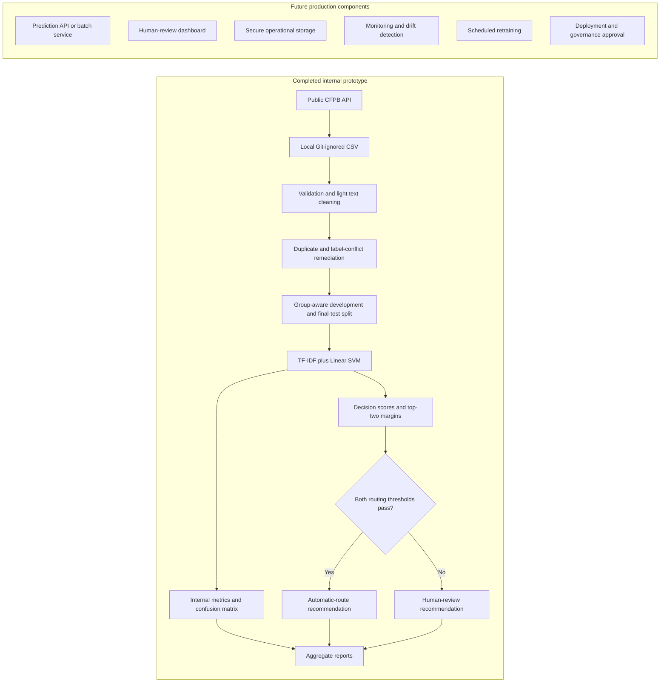

# System Design

## Scope

This repository implements a notebook-centered internal prototype for CFPB complaint classification, leakage-safe evaluation, and human-review routing analysis. It does not implement a production prediction service.

## Architecture

The completed and future subgraphs are intentionally separate. The repository produces model and routing evidence; it does not connect the prototype to live complaint intake or downstream business systems.

## Component Status

| Component | Status | Evidence or boundary |
| --- | --- | --- |
| Data ingestion | Completed for local research use | `notebooks/01_data_download.ipynb`, `docs/data_ingestion.md` |
| Data validation and text preparation | Completed | Notebooks 02-04 and aggregate documentation |
| Duplicate-leakage remediation | Completed | Conflicting groups removed; group overlap asserted as zero |
| Model comparison | Completed | Logistic Regression, Multinomial Naive Bayes, and Linear SVM |
| Selected classifier | Completed | TF-IDF + Linear SVM |
| Internal evaluation | Completed | 2024 final internal test metrics and confusion matrix |
| Routing analysis | Completed | Locked score and margin thresholds |
| Routing-rule implementation | Completed for prototype use | `src/routing_rules.py` |
| Routing-rule tests | Completed | `tests/test_routing_rules.py` |
| Aggregate reporting | Completed | Results summary, error analysis, model card, and figures |
| Fitted model artifact | Local only | Git-ignored; not distributed in the repository |
| Prediction interface | Not implemented | `src/predict.py` remains a placeholder |
| Production deployment | Not implemented or approved | Future work |

## Completed Data Flow

### 1. Ingestion and Validation

The data-ingestion notebook retrieves public CFPB complaints and validates required fields, date coverage, complaint identifiers, narrative availability, and product labels. Raw CSV files are stored locally under `data/raw/` and ignored by Git.

Version 1 uses only the validated 2024 sample. The separate 2025 file was not loaded or used for model selection, internal evaluation, or routing-threshold selection.

### 2. Text Preparation

The prototype:

- removes URL-like text;
- collapses repeated whitespace;
- trims surrounding whitespace;
- checks missing narratives and labels;
- reports text-length outliers in aggregate; and
- preserves most language for TF-IDF.

Processed CSV files remain local and Git-ignored.

### 3. Leakage-Safe Modeling

Normalized cleaned text is represented by a stable SHA-256 grouping key. Conflicting-label groups are excluded, repeated same-label groups are reduced to one representative, and group-aware partitioning prevents normalized text from crossing development and final-test boundaries.

The selected Scikit-learn pipeline combines TF-IDF and Linear SVM. The pipeline is fitted locally and saved to an ignored model path; it is not a committed deployable artifact.

### 4. Internal Evaluation

The workflow reports:

- Accuracy, Macro F1, and Weighted F1;
- per-category precision, recall, F1, and support;
- a row-normalized confusion matrix;
- duplicate-leakage audit results; and
- aggregate error interpretation.

All reported evaluation data is aggregate. Complaint narratives and row-level predictions are not committed.

### 5. Routing Rules

The routing policy uses:

- minimum top decision score: 0.08; and
- minimum top-two score margin: 0.73.

Both conditions must pass for an automatic-routing recommendation. Otherwise, the result is a human-review recommendation. Decision scores are not calibrated probabilities.

`src/routing_rules.py` validates score arrays and class-label alignment, applies inclusive threshold boundaries, and routes tied, malformed, non-finite, or below-threshold scores to review.

### 6. Human Review

The repository identifies cases for review but does not implement a review queue or dashboard. A future operational workflow would need:

- reviewer identity and access controls;
- reason codes, overrides, and escalation rules;
- category-specific risk policies;
- audit logging;
- service-level expectations; and
- feedback and quality-review processes.

### 7. Reporting

Completed reporting includes:

- `reports/results_summary.md`;
- `reports/error_analysis.md`;
- `reports/model_card.md`;
- `reports/figures/confusion_matrix.png`; and
- `reports/figures/routing_decision_score_summary.png`.

## Future Production Architecture

The following components are not implemented:

### Prediction API or Batch Service

A supported service would need versioned preprocessing, model loading, input validation, authentication, rate limits, error handling, and reproducible deployment.

### Dashboard and Human-Review Queue

A future interface would present the recommended category, review reason, relevant model signals, and approved context without exposing unnecessary sensitive text.

### Secure Production Storage

Production complaint text and outputs would require encryption, access controls, retention rules, deletion procedures, environment separation, and privacy review.

### Monitoring

A monitoring system would track data quality, category distributions, routing coverage, review rates, overrides, per-category performance, score and margin distributions, drift, latency, and service health. No live monitoring result exists.

### Scheduled Retraining

Retraining would require a versioned label taxonomy, reviewed training data, reproducible pipelines, regression tests, independent evaluation, rollback plans, and a new protected holdout.

### Deployment and Governance Approval

Any deployment would require privacy, security, compliance, model-risk, operational, and stakeholder approval. The current thresholds are project assumptions and are not approved production limits.

## Security and Privacy Boundaries

- Raw and processed CSV files are local and ignored by Git.
- Fitted model artifacts are local and ignored by Git.
- Complaint narratives and row-level predictions are excluded from reports.
- The repository contains aggregate metrics and public-data workflow code only.
- Public availability of a narrative does not remove the need for stronger controls in a production environment.
