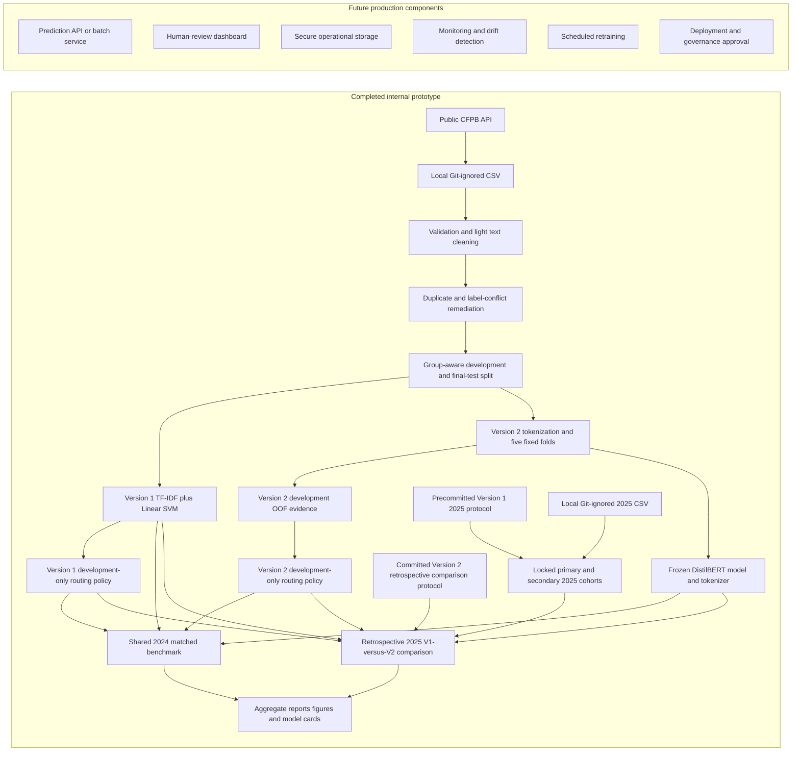

# System Design

## Scope

This repository implements a notebook-centered AI/NLP business solution prototype for CFPB complaint classification, leakage-safe evaluation, selective routing with human review, and champion-challenger analysis. The completed evidence includes the Version 1 TF-IDF + Linear SVM benchmark, the frozen Version 2 DistilBERT challenger, a shared 2024 matched comparison, and a retrospective 2025 comparison. It does not implement a production prediction service.

## Architecture

The completed and future subgraphs are intentionally separate. The repository produces model and routing evidence; it does not connect the prototype to live complaint intake or downstream business systems.

## Component Status

| Component | Status | Evidence or boundary |
| --- | --- | --- |
| Data ingestion | Completed for local research use | `notebooks/01_data_download.ipynb`, `docs/data_ingestion.md` |
| Data validation and text preparation | Completed | Notebooks 02-04 and aggregate documentation |
| Duplicate-leakage remediation | Completed | Conflicting groups removed; group overlap asserted as zero |
| Version 1 benchmark development | Completed | Logistic Regression, Multinomial Naive Bayes, and Linear SVM comparison; TF-IDF + Linear SVM selected |
| Version 1 internal evaluation | Completed | Locked 2024 final internal-test metrics and confusion matrix |
| Version 1 routing analysis | Completed | Development-selected decision-score and margin thresholds |
| Routing-rule implementation | Completed for prototype use | `src/routing_rules.py` |
| Routing-rule tests | Completed | `tests/test_routing_rules.py` |
| Version 2 data and tokenization preparation | Completed | `notebooks/08_v2_transformer_data_preparation.ipynb`, `reports/v2_data_manifest.md` |
| Five-fold DistilBERT development training | Completed | `notebooks/09_v2_distilbert_training.ipynb`; one OOF result per development row |
| Frozen Version 2 artifact | Completed locally | `reports/v2_model_manifest.md`; model and tokenizer are Git-ignored and not distributed |
| Version 2 development OOF evidence | Completed | `reports/v2_development_results.md` |
| Version 2 routing policy | Completed | Separate policy selected from development OOF outputs only; documented in `reports/v1_v2_2024_comparison.md` |
| Shared 2024 V1-versus-V2 comparison | Completed | `reports/v1_v2_2024_comparison.md`; matched 6,609-row benchmark, not a new untouched Version 2 holdout |
| Version 1 pre-holdout protocol | Completed before 2025 access | `reports/2025_validation_protocol.md` |
| 2024 reproduction and 2025 integrity gates | Completed | `notebooks/07_2025_out_of_time_validation.ipynb` |
| 2025 cohort construction | Completed | Primary leakage-resistant and secondary operational cohorts |
| Version 1 2025 out-of-time evaluation | Completed | Classification, routing, drift, and 2024-versus-2025 comparisons |
| Version 2 retrospective 2025 protocol | Completed before Version 2 2025 scoring | `reports/v2_2025_retrospective_protocol.md` |
| Retrospective 2025 V1-versus-V2 comparison | Completed | `reports/v2_2025_retrospective_results.md`; primary is headline, secondary is sensitivity |
| Version 1 and Version 2 model cards | Completed | `reports/model_card.md`, `reports/v2_model_card.md` |
| Aggregate reporting | Completed | Version 1 and Version 2 reports, model cards, and aggregate figures |
| Fitted model artifacts | Local only | Git-ignored; not distributed in the repository |
| Prediction interface | Not implemented | No supported inference module, API, CLI, or batch service is provided |
| Production deployment | Not implemented or approved | Future work |

## Completed Data Flow

### 1. Ingestion and Validation

The data-ingestion notebook retrieves public CFPB complaints and validates required fields, date coverage, complaint identifiers, narrative availability, and product labels. Raw CSV files are stored locally under `data/raw/` and ignored by Git.

Version 1 development, model selection, internal evaluation, and routing-threshold selection used only the validated 2024 sample. Version 2 used the same locked 2024 development and final-test boundaries, and all Version 2 training and routing-policy selection used development data only. The separate 2025 file was protected during Version 1 development, evaluated once under its committed protocol, and later reused only for the frozen retrospective V1-versus-V2 comparison.

### 2. Text Preparation

The prototype:

- removes URL-like text;
- collapses repeated whitespace;
- trims surrounding whitespace;
- checks missing narratives and labels;
- reports text-length outliers in aggregate; and
- preserves most language for model-specific TF-IDF or tokenizer processing.

Processed CSV files remain local and Git-ignored.

### 3. Leakage-Safe Modeling

Normalized cleaned text is represented by a stable SHA-256 grouping key. Conflicting-label groups are excluded, repeated same-label groups are reduced to one representative, and group-aware partitioning prevents normalized text from crossing development and final-test boundaries.

The Version 1 Scikit-learn pipeline combines TF-IDF and Linear SVM. Version 2 applies the frozen DistilBERT tokenizer to the same leakage-safe development boundary, uses five fixed development folds for OOF evidence, and trains one final model on all 26,433 development rows. Both fitted artifacts remain local and Git-ignored; neither is a committed deployable artifact.

### 4. Internal Evaluation

The workflow reports:

- Accuracy, Macro F1, and Weighted F1;
- per-category precision, recall, F1, and support;
- a row-normalized confusion matrix;
- duplicate-leakage audit results; and
- aggregate error interpretation.

The 6,609-row final internal test is the locked Version 1 reference and the shared matched benchmark for V1-versus-V2 comparison. Because Version 1 outcomes were already known, it is not a new untouched Version 2 holdout. All reported evaluation data is aggregate; complaint narratives and row-level predictions are not committed.

### 5. Routing Rules

The Version 1 routing policy uses:

- minimum top decision score: 0.08; and
- minimum top-two score margin: 0.73.

Both conditions must pass for an automatic-routing recommendation. Otherwise, the result is a human-review recommendation. Version 2 has a separate policy selected only from development OOF evidence: minimum top softmax score `0.22` and minimum top-two margin `0.91`. Version 1 decision scores and Version 2 softmax scores and margins are uncalibrated model signals, not probabilities or real-world confidence.

`src/routing_rules.py` validates score arrays and class-label alignment, applies inclusive threshold boundaries, and routes tied, malformed, non-finite, or below-threshold scores to review.

### 6. Human Review

The repository identifies cases for review but does not implement a review queue or dashboard. A future operational workflow would need:

- reviewer identity and access controls;
- reason codes, overrides, and escalation rules;
- category-specific risk policies;
- audit logging;
- service-level expectations; and
- feedback and quality-review processes.

### 7. Locked Version 1 2025 Out-of-Time Validation

Before opening the 2025 CSV, the project committed the model configuration, cleaning rules, file fingerprints, classes, cohorts, metrics, comparison rules, and routing thresholds. Notebook 07 then:

- reproduced the complete locked 2024 reference gate;
- verified the 2025 file path, size, fingerprint, and ingestion structure;
- constructed the 30,156-row primary leakage-resistant headline cohort;
- constructed the 49,225-row secondary operational sensitivity cohort, which retains repeated text and cross-year overlap; and
- evaluated classification, routing, category behavior, and descriptive drift without fitting or changing the workflow.

Primary 2025 accuracy was 0.8315, Macro F1 was 0.7527, and routing coverage was 0.7251 with 0.9203 routed accuracy and a 0.0797 misroute rate. These weaker headline results are reported directly; the more favorable secondary cohort remains a sensitivity view.

The 2025 sample is now exhausted as an unbiased holdout. Any future model or routing-policy change requires a new untouched validation period.

### 8. Version 2 Development and Frozen Artifact

Notebooks 08 and 09 reproduce the locked data boundary, audit token lengths using development data only, generate complete five-fold OOF evidence, and freeze the final DistilBERT model and tokenizer. The 256-token maximum and Version 2 routing policy were locked before benchmark or retrospective scoring. Model weights, tokenizer files, checkpoints, OOF outputs, and row-level results remain local and Git-ignored.

### 9. Shared 2024 and Retrospective 2025 Comparisons

Notebook 10 compares the frozen models and their separately selected policies on the same 6,609-row 2024 benchmark, including classification, routing, category risk, artifact size, and local inference performance. This is a matched benchmark, not independent temporal validation for Version 2.

Under the committed Version 2 retrospective protocol, Notebook 11 applies both frozen models and policies to the existing 2025 cohorts without changing either workflow. The 30,156-row primary leakage-resistant cohort is the headline result; the 49,225-row secondary operational cohort retains repeated texts and cross-year overlap and is a sensitivity view. This comparison is retrospective because Version 1 had already used the 2025 sample. No model, tokenizer, cohort rule, routing policy, or threshold was changed using 2025 results.

Version 1 remains the temporally validated benchmark. Version 2 remains the frozen transformer challenger. Independent Version 2 promotion evidence requires a new untouched period, currently planned as full-year 2026; that future evaluation is not required to complete the current portfolio project.

### 10. Reporting

Completed reporting includes:

- `notebooks/07_2025_out_of_time_validation.ipynb`;
- `notebooks/08_v2_transformer_data_preparation.ipynb`;
- `notebooks/09_v2_distilbert_training.ipynb`;
- `notebooks/10_v1_v2_champion_challenger_comparison.ipynb`;
- `notebooks/11_v2_2025_retrospective_comparison.ipynb`;
- `reports/2025_validation_protocol.md`;
- `reports/2025_holdout_results.md`;
- `reports/results_summary.md`;
- `reports/error_analysis.md`;
- `reports/model_card.md`;
- `reports/v2_data_manifest.md`;
- `reports/v2_development_results.md`;
- `reports/v2_model_manifest.md`;
- `reports/v1_v2_2024_comparison.md`;
- `reports/v2_2025_retrospective_protocol.md`;
- `reports/v2_2025_retrospective_results.md`;
- `reports/v2_model_card.md`;
- `reports/figures/confusion_matrix.png`;
- `reports/figures/routing_decision_score_summary.png`;
- `reports/figures/2025_confusion_matrix.png`;
- `reports/figures/2024_vs_2025_comparison.png`;
- `reports/figures/v2_development_confusion_matrix.png`;
- `reports/figures/v1_v2_2024_confusion_matrices.png`;
- `reports/figures/v1_v2_2024_routing_comparison.png`;
- `reports/figures/v1_v2_2024_compute_comparison.png`;
- `reports/figures/v1_v2_2025_primary_confusion_matrices.png`;
- `reports/figures/v1_v2_2025_retrospective_comparison.png`;
- `reports/figures/v1_v2_2025_routing_comparison.png`; and
- `reports/figures/v2_2025_signal_token_drift.png`.

## Future Production Architecture

The following components are not implemented:

### Prediction API or Batch Service

A supported service would need versioned preprocessing, model loading, input validation, authentication, rate limits, error handling, and reproducible deployment.

### Dashboard and Human-Review Queue

A future interface would present the recommended category, review reason, relevant model signals, and approved context without exposing unnecessary sensitive text.

### Secure Production Storage

Production complaint text and outputs would require encryption, access controls, retention rules, deletion procedures, environment separation, and privacy review.

### Monitoring

A monitoring system would track data quality, category distributions, routing coverage, review rates, overrides, per-category performance, score and margin distributions, drift, latency, and service health. No live monitoring result exists.

### Scheduled Retraining

Retraining would require a versioned label taxonomy, reviewed training data, reproducible pipelines, regression tests, independent evaluation, rollback plans, and a new protected holdout.

### Deployment and Governance Approval

Any deployment would require privacy, security, compliance, model-risk, operational, and stakeholder approval. The current thresholds are project assumptions and are not approved production limits.

## Security and Privacy Boundaries

- Raw and processed CSV files are local and ignored by Git.
- Fitted model artifacts are local and ignored by Git.
- Complaint narratives and row-level predictions are excluded from reports.
- The repository contains aggregate metrics and public-data workflow code only.
- Public availability of a narrative does not remove the need for stronger controls in a production environment.
