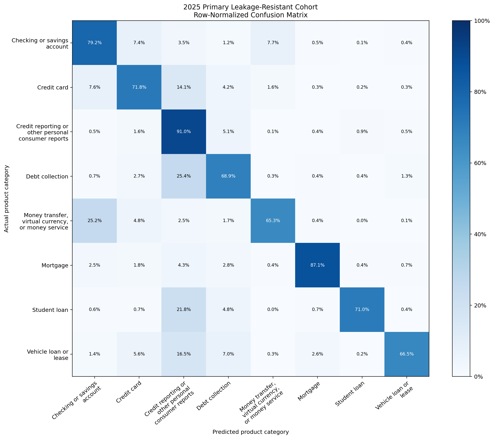

# Version 1 2025 Out-of-Time Holdout Results

## Status

Version 1 2025 out-of-time validation is complete. The fitted TF-IDF + Linear SVM model, eight-category scope, text preparation, class order, evaluation rules, and decision-score routing policy remained locked throughout the evaluation. The routing thresholds remained a minimum top decision score of `0.08` and a minimum top-two score margin of `0.73`.

The 2025 dataset has now been inspected and evaluated. It is no longer an untouched, unbiased holdout and must not be reused to tune or select a future model or routing policy.

## Evaluation Design

The locked 6,609-row 2024 final internal-test partition is the temporal reference. The 30,156-row 2025 primary leakage-resistant cohort is the headline result because it excludes normalized-text overlap with either locked 2024 partition, removes every 2025 conflicting-label text group, and retains one row per remaining repeated same-label text.

The 49,225-row 2025 secondary operational cohort is a sensitivity view. It retains all otherwise eligible locked-scope rows, including repeated texts and cross-year overlap, so it is not the headline generalization estimate and may appear more favorable.

No retraining, tuning, calibration, model selection, category change, exclusion change, or routing-threshold change occurred.

## Holdout Integrity and Data Validation

The fingerprinted source `data/raw/cfpb_complaints_2025_raw.csv` reproduced the committed ingestion expectations:

| Validation item | Result |
| --- | ---: |
| Raw rows | 50,000 |
| Raw columns | 17 |
| Minimum `date_received` | 2025-01-01 |
| Maximum `date_received` | 2025-12-31 |
| Rows outside calendar year 2025 | 0 |
| Unparseable nonblank dates | 0 |
| Duplicate `complaint_id` values | 0 |
| Missing or blank narratives | 0 |
| Missing or blank product labels | 0 |
| Missing or blank dates | 0 |
| Missing or blank complaint IDs | 0 |
| Locked eight-category rows | 49,225 |
| Familiar out-of-scope rows | 775 |
| Familiar out-of-scope label values | 3 |
| Unfamiliar label values | 0 |
| Changed label values | 0 |

The three familiar out-of-scope labels were:

| Familiar out-of-scope product label | Rows |
| --- | ---: |
| Payday loan, title loan, personal loan, or advance | 403 |
| Prepaid card | 238 |
| Debt or credit management | 134 |

The required raw fields—`complaint_what_happened`, `product`, `date_received`, and `complaint_id`—were present. Locked cleaning produced zero empty narratives.

## Duplicate and Cross-Year Audit

Only aggregate counts are reported; complaint narratives and normalized-text hashes remain local-only.

| Audit | Unique groups | Affected rows |
| --- | ---: | ---: |
| Overlap with 2024 development | 161 | 3,772 |
| Overlap with 2024 final internal test | 42 | 1,807 |
| Overlap with either 2024 partition | 203 | 5,579 |
| Repeated same-label normalized-text groups within 2025 | 5,033 | 23,843 |
| Conflicting-label normalized-text groups within 2025 | 37 | 1,660 |

## Evaluation Cohorts

The secondary cohort contains all 49,225 otherwise eligible locked-scope rows. The primary cohort was created through the committed sequential exclusions:

| Primary-cohort stage | Excluded at stage | Remaining |
| --- | ---: | ---: |
| Start with secondary locked-scope rows | 0 | 49,225 |
| Exclude overlap with either 2024 partition | 5,579 | 43,646 |
| Exclude remaining 2025 conflicting-label groups | 1,301 | 42,345 |
| Keep the first remaining same-label text | 12,189 | 30,156 |
| Final primary leakage-resistant cohort | 0 | 30,156 |

The primary cohort is the headline result because it provides the conservative prior-text-free comparison specified before the holdout was opened. The secondary cohort may appear more favorable because repeated texts and cross-year overlap remain present; that observation does not establish that those records caused its performance difference.

## Classification Results

### Overall classification

All calculations used the fitted `pipeline.classes_` order and `zero_division=0`. Differences are calculated from full-precision values and displayed as `2025 - 2024`.

| Cohort | Rows | Accuracy | Macro precision | Macro recall | Macro F1 | Weighted precision | Weighted recall | Weighted F1 |
| --- | ---: | ---: | ---: | ---: | ---: | ---: | ---: | ---: |
| Locked 2024 final internal test | 6,609 | 0.8712 | 0.7734 | 0.7621 | 0.7671 | 0.8721 | 0.8712 | 0.8715 |
| 2025 primary leakage-resistant | 30,156 | 0.8315 | 0.7577 | 0.7508 | 0.7527 | 0.8312 | 0.8315 | 0.8306 |
| 2025 secondary sensitivity | 49,225 | 0.8771 | 0.7573 | 0.7592 | 0.7569 | 0.8770 | 0.8771 | 0.8766 |

| Comparison | Accuracy | Macro precision | Macro recall | Macro F1 | Weighted precision | Weighted recall | Weighted F1 |
| --- | ---: | ---: | ---: | ---: | ---: | ---: | ---: |
| 2025 primary minus 2024 | -0.0397 | -0.0157 | -0.0113 | -0.0145 | -0.0409 | -0.0397 | -0.0408 |
| 2025 secondary minus 2024 | +0.0059 | -0.0161 | -0.0029 | -0.0102 | +0.0050 | +0.0059 | +0.0052 |
| 2025 secondary minus primary | +0.0456 | -0.0005 | +0.0084 | +0.0042 | +0.0458 | +0.0456 | +0.0460 |

### 2025 per-category classification

| Cohort | Product category | Precision | Recall | F1 | Support |
| --- | --- | ---: | ---: | ---: | ---: |
| Primary | Checking or savings account | 0.7115 | 0.7917 | 0.7495 | 2,165 |
| Primary | Credit card | 0.6977 | 0.7182 | 0.7078 | 2,253 |
| Primary | Credit reporting or other personal consumer reports | 0.8990 | 0.9097 | 0.9043 | 17,843 |
| Primary | Debt collection | 0.7301 | 0.6889 | 0.7089 | 4,484 |
| Primary | Money transfer, virtual currency, or money service | 0.8105 | 0.6530 | 0.7233 | 1,507 |
| Primary | Mortgage | 0.8248 | 0.8707 | 0.8471 | 719 |
| Primary | Student loan | 0.6821 | 0.7098 | 0.6957 | 541 |
| Primary | Vehicle loan or lease | 0.7063 | 0.6646 | 0.6848 | 644 |
| Secondary | Checking or savings account | 0.7146 | 0.7942 | 0.7523 | 2,216 |
| Secondary | Credit card | 0.6750 | 0.6935 | 0.6842 | 2,369 |
| Secondary | Credit reporting or other personal consumer reports | 0.9350 | 0.9406 | 0.9378 | 35,215 |
| Secondary | Debt collection | 0.7241 | 0.6854 | 0.7042 | 5,664 |
| Secondary | Money transfer, virtual currency, or money service | 0.8502 | 0.7154 | 0.7770 | 1,848 |
| Secondary | Mortgage | 0.8185 | 0.8708 | 0.8439 | 720 |
| Secondary | Student loan | 0.6549 | 0.7112 | 0.6819 | 547 |
| Secondary | Vehicle loan or lease | 0.6859 | 0.6625 | 0.6740 | 646 |

Against the locked 2024 reference, primary money-transfer F1 increased by 0.1455 while student-loan F1 decreased by 0.1397. Primary credit-card F1 decreased by 0.0391 and debt-collection F1 decreased by 0.0331. These are observed temporal differences, not evidence of their cause.

## Routing Results

Both locked thresholds had to pass for automatic routing. Linear SVM decision scores and score margins are model signals, not calibrated probabilities.

### Overall routing

| Cohort | Rows | Auto-routed | Human review | Coverage | Review rate | Correct routed | Incorrect routed | Routed accuracy | Misroute rate |
| --- | ---: | ---: | ---: | ---: | ---: | ---: | ---: | ---: | ---: |
| Locked 2024 final internal test | 6,609 | 5,092 | 1,517 | 0.7705 | 0.2295 | 4,839 | 253 | 0.9503 | 0.0497 |
| 2025 primary leakage-resistant | 30,156 | 21,867 | 8,289 | 0.7251 | 0.2749 | 20,125 | 1,742 | 0.9203 | 0.0797 |
| 2025 secondary sensitivity | 49,225 | 38,442 | 10,783 | 0.7809 | 0.2191 | 36,227 | 2,215 | 0.9424 | 0.0576 |

| Comparison | Coverage | Review rate | Routed accuracy | Misroute rate |
| --- | ---: | ---: | ---: | ---: |
| 2025 primary minus 2024 | -0.0453 | +0.0453 | -0.0300 | +0.0300 |
| 2025 secondary minus 2024 | +0.0105 | -0.0105 | -0.0079 | +0.0079 |
| 2025 secondary minus primary | +0.0558 | -0.0558 | +0.0220 | -0.0220 |

The primary 2025 misroute rate was 0.0797, higher than the locked 2024 result of 0.0497. Primary coverage and routed accuracy also declined, while its human-review rate increased.

### Mutually exclusive human-review reasons

Shares use each cohort's human-review rows as the denominator.

| Cohort | Review reason | Count | Share |
| --- | --- | ---: | ---: |
| Locked 2024 final internal test | Low top score and low score margin | 1,029 | 0.6783 |
| Locked 2024 final internal test | Low score margin | 412 | 0.2716 |
| Locked 2024 final internal test | Low top score | 76 | 0.0501 |
| 2025 primary leakage-resistant | Low top score and low score margin | 5,514 | 0.6652 |
| 2025 primary leakage-resistant | Low score margin | 2,460 | 0.2968 |
| 2025 primary leakage-resistant | Low top score | 315 | 0.0380 |
| 2025 secondary sensitivity | Low top score and low score margin | 7,048 | 0.6536 |
| 2025 secondary sensitivity | Low score margin | 3,318 | 0.3077 |
| 2025 secondary sensitivity | Low top score | 417 | 0.0387 |

### 2025 category-level routing

| Cohort | Product category | Support | Auto-routed | Coverage | Review rate | Routed accuracy | Misroute rate |
| --- | --- | ---: | ---: | ---: | ---: | ---: | ---: |
| Primary | Checking or savings account | 2,165 | 1,298 | 0.5995 | 0.4005 | 0.9291 | 0.0709 |
| Primary | Credit card | 2,253 | 1,323 | 0.5872 | 0.4128 | 0.8443 | 0.1557 |
| Primary | Credit reporting or other personal consumer reports | 17,843 | 14,717 | 0.8248 | 0.1752 | 0.9643 | 0.0357 |
| Primary | Debt collection | 4,484 | 2,733 | 0.6095 | 0.3905 | 0.7644 | 0.2356 |
| Primary | Money transfer, virtual currency, or money service | 1,507 | 719 | 0.4771 | 0.5229 | 0.7983 | 0.2017 |
| Primary | Mortgage | 719 | 496 | 0.6898 | 0.3102 | 0.9657 | 0.0343 |
| Primary | Student loan | 541 | 282 | 0.5213 | 0.4787 | 0.8333 | 0.1667 |
| Primary | Vehicle loan or lease | 644 | 299 | 0.4643 | 0.5357 | 0.7826 | 0.2174 |
| Secondary | Checking or savings account | 2,216 | 1,347 | 0.6079 | 0.3921 | 0.9295 | 0.0705 |
| Secondary | Credit card | 2,369 | 1,405 | 0.5931 | 0.4069 | 0.7972 | 0.2028 |
| Secondary | Credit reporting or other personal consumer reports | 35,215 | 30,361 | 0.8622 | 0.1378 | 0.9773 | 0.0227 |
| Secondary | Debt collection | 5,664 | 3,285 | 0.5800 | 0.4200 | 0.7349 | 0.2651 |
| Secondary | Money transfer, virtual currency, or money service | 1,848 | 965 | 0.5222 | 0.4778 | 0.8497 | 0.1503 |
| Secondary | Mortgage | 720 | 497 | 0.6903 | 0.3097 | 0.9658 | 0.0342 |
| Secondary | Student loan | 547 | 282 | 0.5155 | 0.4845 | 0.8333 | 0.1667 |
| Secondary | Vehicle loan or lease | 646 | 300 | 0.4644 | 0.5356 | 0.7800 | 0.2200 |

No evaluated category had zero auto-routed rows. Category estimates remain less stable where support or auto-routed counts are smaller.

## Drift Diagnostics

All drift statistics are descriptive diagnostics. They do not establish statistical significance, causality, or a specific cause.

### Label distributions

| Comparison with locked 2024 reference | Actual-label Jensen-Shannon distance, base 2 | Predicted-label Jensen-Shannon distance, base 2 |
| --- | ---: | ---: |
| 2025 primary | 0.0827 | 0.0673 |
| 2025 secondary | 0.0921 | 0.0885 |

Credit reporting represented 0.6549 of the 2024 reference, 0.5917 of the primary cohort, and 0.7154 of the secondary cohort. Its actual share changed by -6.3175 percentage points in primary and +6.0524 points in secondary. Raw count differences are also affected by the different cohort sizes.

### Text and locked-vocabulary behavior

| Cohort | Mean cleaned characters | Median cleaned characters | Mean whitespace tokens | Median whitespace tokens | Mean nonzero TF-IDF features | Median nonzero TF-IDF features | All-zero rows | All-zero rate |
| --- | ---: | ---: | ---: | ---: | ---: | ---: | ---: | ---: |
| Locked 2024 final internal test | 1,268.67 | 808 | 220.13 | 143 | 215.87 | 166 | 0 | 0.0000 |
| 2025 primary | 1,322.44 | 918 | 221.82 | 156 | 218.82 | 176 | 0 | 0.0000 |
| 2025 secondary | 1,143.73 | 813 | 191.56 | 135 | 198.61 | 161 | 0 | 0.0000 |

The primary-versus-2024 two-sample KS statistics were 0.0542 for cleaned character length and 0.0469 for whitespace-token count. The secondary statistics were 0.0534 and 0.0661. The fitted vocabulary and IDF values were not rebuilt or modified.

### Decision-score and margin behavior

| Cohort | Mean top score | Mean top-two margin | Failed top score | Failed margin | Failed both |
| --- | ---: | ---: | ---: | ---: | ---: |
| Locked 2024 final internal test | 0.6546 | 1.4886 | 0.1672 | 0.2180 | 0.1557 |
| 2025 primary | 0.6321 | 1.4221 | 0.1933 | 0.2644 | 0.1828 |
| 2025 secondary | 0.6838 | 1.5395 | 0.1517 | 0.2106 | 0.1432 |

Primary-versus-2024 KS statistics were 0.0519 for top decision score and 0.0646 for top-two margin; secondary-versus-2024 values were 0.0322 and 0.0399. Threshold-failure rates overlap and do not sum to 100%. Their mutually exclusive routing reasons are reported separately above.

The primary routing policy became more conservative in aggregate: coverage decreased by 0.0453 and review rate increased by 0.0453. Secondary coverage was 0.0105 above the locked 2024 reference.

## Main Findings

- Headline primary generalization weakened: accuracy decreased by 0.0397, macro F1 by 0.0145, and weighted F1 by 0.0408.
- Primary routing coverage decreased by 0.0453 and routed accuracy decreased by 0.0300.
- Primary human-review rate increased by 0.0453 and misroute rate increased by 0.0300.
- Macro F1 declined less than weighted F1, reflecting differences across categories and the influence of the dominant credit-reporting category.
- Credit reporting remained dominant and represented 59.17% of the primary cohort and 71.54% of the secondary cohort.
- Primary money-transfer F1 improved by 0.1455, while primary student-loan F1 declined by 0.1397.
- Category-level results are less stable where support and auto-routed counts are smaller.
- Secondary results are a sensitivity view and do not replace the primary leakage-resistant headline result.

## Limitations

- The 2025 source is a 50,000-row CFPB sample, not the complete operational complaint population.
- The evaluation covers only the eight locked Version 1 product categories.
- Smaller categories and smaller auto-routed counts yield less-stable category estimates.
- The secondary cohort includes repeated texts and overlap with prior-year reference groups.
- Linear SVM decision scores and score margins are not calibrated probabilities.
- The routing thresholds are project assumptions, not stakeholder-approved or production-validated standards.
- Good or poor holdout results alone do not establish production readiness or deployment suitability.
- The evaluation does not establish causality, statistical significance, cost savings, or workload reduction.
- The 2025 dataset is no longer an untouched holdout and cannot be reused for unbiased future tuning or model selection.
- Complaint narratives may contain sensitive information; any operational use would require stronger privacy, access, retention, and governance controls.

## Figures

### Primary 2025 row-normalized confusion matrix

### Locked 2024 versus 2025 aggregate comparison

The comparison figure treats the primary cohort as the headline result and the secondary operational cohort as a sensitivity view that retains repeated texts and cross-year overlap.

## Reproducibility and Data Handling

The figures and report values are cross-validated against the executed aggregate tables in `notebooks/07_2025_out_of_time_validation.ipynb`. No complaint narrative, normalized-text hash, row-level prediction, row-level decision score, processed 2025 CSV, or model artifact is included in this report.
