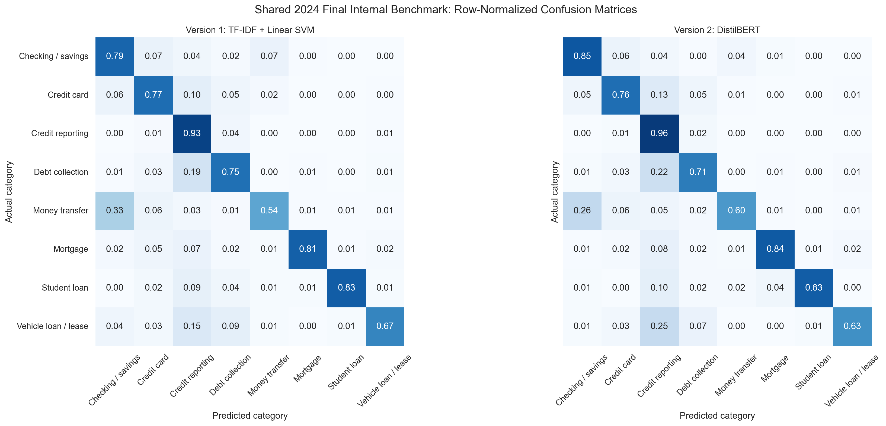
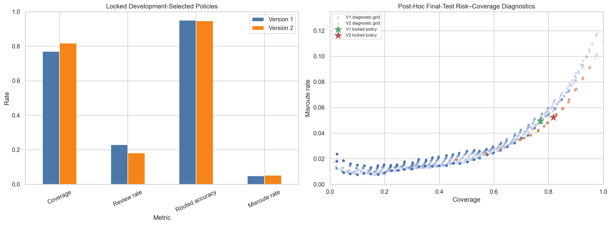
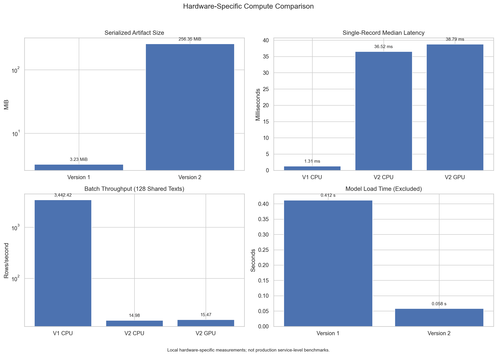

# Version 1–Version 2 Comparison on the Shared 2024 Benchmark

## Status and scope

This report compares the locked Version 1 TF-IDF + Linear SVM benchmark with the frozen Version 2 DistilBERT challenger on the same 6,609-row 2024 final internal-test partition. The source fingerprint, 33,042 corrected modeling rows, 26,433-row development partition, final-test boundary, zero normalized-text overlap, and canonical eight-category order were reproduced before scoring.

The Version 2 routing policy was selected and written to a fingerprinted, Git-ignored local record using only the 26,433 development out-of-fold (OOF) outputs. The record explicitly confirms that final-test data had not been loaded. It was then reloaded and validated before either frozen model was evaluated on the final internal test.

- Local policy path: `models/v1_v2_2024_comparison/v2_routing_policy.json`
- Policy SHA-256: `9ca16a8533f26f8e00fd9d57c654af66fa78e21880f7fa7783a9d1adf964d818`

This is a matched shared-benchmark comparison, not a new untouched Version 2 holdout. Version 1 results on this partition were already known. Neither model was retrained, fine-tuned, recalibrated, or modified, and no 2025 or 2026 data was accessed.

## Locked models and routing policies

| Item | Version 1 | Version 2 |
|---|---:|---:|
| Model | TF-IDF + Linear SVM | DistilBERT sequence classifier |
| Policy-selection source | Locked Version 1 development work | Development OOF outputs only |
| Top-score threshold | 0.08 | 0.22 |
| Top-two margin threshold | 0.73 | 0.91 |
| Score interpretation | Uncalibrated decision signal | Uncalibrated softmax signal |

For Version 2, quantiles from 0.000 through 0.975 in 0.025 increments were rounded to two decimals and deduplicated. All 304 candidate pairs used inclusive comparisons and required a positive margin. Of these, 170 met the precommitted minimum development coverage of 0.05 and maximum development OOF misroute rate of 0.05. Deterministic selection by highest coverage, then lower misroute rate, lower top-score threshold, and lower margin threshold produced:

| Development OOF routing result | Version 2 |
|---|---:|
| Rows | 26,433 |
| Auto-routed rows | 19,957 |
| Human-review rows | 6,476 |
| Coverage | 0.7550 |
| Routed accuracy | 0.9514 |
| Misroute rate | 0.0486 |

The two model families have different score scales, so the Version 1 thresholds were not reused for Version 2. Neither set of scores is a calibrated probability or real-world confidence estimate.

## Classification comparison

All calculations use the same 6,609 rows and the same class order.

| Metric | Version 1 | Version 2 | V2 − V1 |
|---|---:|---:|---:|
| Accuracy | 0.8712 | 0.8882 | +0.0169 |
| Macro precision | 0.7734 | 0.8238 | +0.0504 |
| Macro recall | 0.7621 | 0.7708 | +0.0088 |
| Macro F1 | 0.7671 | 0.7949 | +0.0278 |
| Weighted precision | 0.8721 | 0.8852 | +0.0132 |
| Weighted recall | 0.8712 | 0.8882 | +0.0169 |
| Weighted F1 | 0.8715 | 0.8859 | +0.0144 |

Version 2 improved the aggregate classification metrics, including the primary balanced measure, Macro F1. The largest F1 gain was for money transfer (+0.0967), followed by checking or savings (+0.0605) and student loan (+0.0386). Vehicle loan or lease declined by 0.0206. Smaller categories have less-stable estimates, so these differences should be interpreted with their support counts.

Version 2 final-test scoring used evaluation-only inference with batch size 16, maximum token length 256, truncation, dynamic padding, and CUDA FP16 autocast. The frozen model and tokenizer were not modified.

| Category | Support | V1 precision | V1 recall | V1 F1 | V2 precision | V2 recall | V2 F1 | F1 difference |
|---|---:|---:|---:|---:|---:|---:|---:|---:|
| Checking or savings account | 428 | 0.7589 | 0.7944 | 0.7763 | 0.8235 | 0.8505 | 0.8368 | +0.0605 |
| Credit card | 507 | 0.7293 | 0.7653 | 0.7469 | 0.7778 | 0.7594 | 0.7685 | +0.0216 |
| Credit reporting or other personal consumer reports | 4,328 | 0.9391 | 0.9330 | 0.9360 | 0.9287 | 0.9600 | 0.9441 | +0.0081 |
| Debt collection | 783 | 0.7332 | 0.7510 | 0.7420 | 0.7929 | 0.7088 | 0.7485 | +0.0065 |
| Money transfer, virtual currency, or money service | 144 | 0.6190 | 0.5417 | 0.5778 | 0.7748 | 0.5972 | 0.6745 | +0.0967 |
| Mortgage | 177 | 0.8780 | 0.8136 | 0.8446 | 0.8757 | 0.8362 | 0.8555 | +0.0109 |
| Student loan | 126 | 0.8455 | 0.8254 | 0.8353 | 0.9286 | 0.8254 | 0.8739 | +0.0386 |
| Vehicle loan or lease | 116 | 0.6842 | 0.6724 | 0.6783 | 0.6887 | 0.6293 | 0.6577 | -0.0206 |

The confusion matrices show improved Version 2 recall for checking or savings, credit reporting, money transfer, and mortgage. Debt-collection recall fell from 0.7510 to 0.7088, and vehicle-loan recall fell from 0.6724 to 0.6293. Credit reporting remains the dominant category and strongly influences weighted metrics.

## Routing comparison

The primary comparison uses only the locked, development-selected policies.

| Metric | Version 1 | Version 2 | V2 − V1 |
|---|---:|---:|---:|
| Auto-routed rows | 5,092 | 5,404 | +312 |
| Human-review rows | 1,517 | 1,205 | -312 |
| Coverage | 0.7705 | 0.8177 | +0.0472 |
| Review rate | 0.2295 | 0.1823 | -0.0472 |
| Correct auto-routes | 4,839 | 5,121 | +282 |
| Incorrect auto-routes | 253 | 283 | +30 |
| Routed accuracy | 0.9503 | 0.9476 | -0.0027 |
| Misroute rate | 0.0497 | 0.0524 | +0.0027 |

Version 2 routed 312 more rows, but it also made 30 more routed errors. Its final-test misroute rate of 0.0524 is slightly above both Version 1's 0.0497 and the 0.05 development constraint. This does not invalidate the precommitted policy selection—the Version 2 OOF rate was 0.0486—but it shows that the development risk constraint did not transfer perfectly to the shared final benchmark.

| Category | Support | V1 coverage | V2 coverage | Coverage difference | V1 misroute rate | V2 misroute rate | Misroute difference |
|---|---:|---:|---:|---:|---:|---:|---:|
| Checking or savings account | 428 | 0.6145 | 0.6986 | +0.0841 | 0.0722 | 0.0836 | +0.0114 |
| Credit card | 507 | 0.6095 | 0.6844 | +0.0750 | 0.1262 | 0.1441 | +0.0179 |
| Credit reporting or other personal consumer reports | 4,328 | 0.8593 | 0.9055 | +0.0462 | 0.0204 | 0.0140 | -0.0064 |
| Debt collection | 783 | 0.6450 | 0.6232 | -0.0217 | 0.1545 | 0.2029 | +0.0484 |
| Money transfer, virtual currency, or money service | 144 | 0.3264 | 0.4931 | +0.1667 | 0.3617 | 0.3521 | -0.0096 |
| Mortgage | 177 | 0.6497 | 0.7514 | +0.1017 | 0.0957 | 0.0827 | -0.0129 |
| Student loan | 126 | 0.6587 | 0.7381 | +0.0794 | 0.0482 | 0.0753 | +0.0271 |
| Vehicle loan or lease | 116 | 0.4397 | 0.4655 | +0.0259 | 0.1765 | 0.2037 | +0.0272 |

Category-level routing risk is uneven for both models. Version 2 improved credit-reporting, money-transfer, and mortgage misroute rates, but debt collection worsened materially and reached 0.2029. Credit card and the two smallest loan categories also worsened. These rates support category-aware human oversight; they are not approved operational risk limits.

### Post-hoc matched-risk and matched-coverage diagnostics

The final-test curves below are descriptive benchmark diagnostics only. They did not change either locked policy.

| Misroute-rate limit | V1 best observed coverage | V2 best observed coverage |
|---:|---:|---:|
| 0.030 | 0.6496 | 0.6234 |
| 0.050 | 0.7738 | 0.7969 |
| 0.075 | 0.8762 | 0.9012 |
| 0.100 | 0.9398 | 0.9703 |

At a 5% post-hoc risk limit, Version 2 showed higher observed coverage (0.7969 versus 0.7738). At the stricter 3% limit, Version 1 showed higher coverage (0.6496 versus 0.6234).

| Coverage target | V1 observed coverage | V1 misroute rate | V2 observed coverage | V2 misroute rate |
|---:|---:|---:|---:|---:|
| 0.25 | 0.2498 | 0.0109 | 0.4641 | 0.0192 |
| 0.50 | 0.4999 | 0.0254 | 0.4641 | 0.0192 |
| 0.75 | 0.7499 | 0.0440 | 0.7559 | 0.0412 |

The rounded final-test diagnostic grid produced no Version 2 point near 25% coverage; the closest point was 46.41%, and it was also the closest point to 50%. This grid-resolution and score-saturation limitation is why the observed coverage is reported alongside each target. These post-hoc results must not be used to revise thresholds.

## Model size and inference performance

The timing protocol was declared before measurement: the same first 128 final-test texts, batch size 16 for both models, two single-record warm-ups followed by ten repetitions, one batch warm-up followed by three repetitions, median measurements, and model-loading time excluded from steady-state latency. Version 2 timing includes tokenization. The CPU exposed six logical threads. GPU timing used the NVIDIA GeForce GTX 1650 with 4,096 MiB and CUDA 12.6.

| Measure | Version 1 CPU | Version 2 CPU | Version 2 GPU |
|---|---:|---:|---:|
| Serialized artifact | 3.23 MiB | 256.35 MiB | 256.35 MiB |
| Single-record median latency | 1.31 ms | 36.52 ms | 38.79 ms |
| 128-row batch median latency | 0.0372 s | 8.5454 s | 8.2732 s |
| Batch throughput | 3,442.42 rows/s | 14.98 rows/s | 15.47 rows/s |
| Measured peak allocated GPU memory | — | — | 442.66 MiB |
| Measured peak reserved GPU memory | — | — | 472.00 MiB |

The Version 2 serialized artifact is approximately 79.2 times larger. On this machine, Version 2 single-record latency was approximately 27.9 times the Version 1 CPU latency on CPU and 29.7 times on GPU, while Version 1 batch throughput was about 230 times the Version 2 CPU result and 222 times the Version 2 GPU result. These values reflect this notebook, hardware, Windows environment, fixed text sample, and implementation; they are not production service-level benchmarks. The measured model-loading times were 0.412 seconds for Version 1 and 0.058 seconds for Version 2; the apparently shorter Version 2 load time reflects the local cache and filesystem state and should not be generalized.

The comparison ran under Python 3.11.15 with scikit-learn 1.9.0, PyTorch 2.9.1+cu126, and Transformers 4.57.6. Version 1 requires the scikit-learn/joblib text-classification stack and runs on CPU. Version 2 additionally requires the PyTorch/Transformers/tokenizer stack; CUDA was available for the measured GPU path but is not required for CPU inference.

Version 1 has a much smaller artifact and simpler CPU-only dependency stack. Version 2 requires PyTorch, Transformers, tokenization, materially more storage, and more demanding latency, memory, monitoring, privacy, and governance controls.

## Business and technical trade-offs

### Version 1 advantages

- Much smaller and faster on the measured local hardware.
- Simpler dependencies, operations, monitoring, and explanation through weighted text features.
- Slightly better routed accuracy and lower misroute rate under the locked policies.
- Already has completed one-time 2025 temporal validation.

### Version 1 disadvantages

- Lower overall, Macro, and weighted classification performance on the shared 2024 benchmark.
- Lower locked-policy coverage.
- Weaker F1 for several categories, especially money transfer and checking or savings.

### Version 2 advantages

- Higher Accuracy, Macro F1, and Weighted F1 on the shared benchmark.
- Higher locked-policy coverage with fewer rows sent to review.
- Stronger F1 in seven of eight categories, including meaningful gains for money transfer and checking or savings.
- Better post-hoc coverage at the 5%, 7.5%, and 10% diagnostic risk limits.

### Version 2 disadvantages and risks

- Slightly lower routed accuracy and a final-test misroute rate above 5% under its locked policy.
- Higher category-level routing risk for debt collection, credit card, student loan, and vehicle loan or lease.
- Vehicle-loan F1 declined, and several small-category estimates are uncertain.
- Approximately 79 times the artifact size and substantially slower local inference.
- Greater dependency, maintenance, privacy, explainability, monitoring, and governance burden.
- The locked 256-token limit truncates a material share of development narratives, as documented in the data manifest.

## Recommendation

**Prefer Version 2 as the internal challenger for a future untouched temporal validation, while retaining Version 1 as the current temporally validated benchmark and the practical low-compute option.**

Version 2 earns continued challenger status because it improved Macro F1 by 0.0278, Accuracy by 0.0169, and locked-policy coverage by 0.0472. It should not replace Version 1 solely from this shared benchmark: its routed accuracy was slightly lower, its misroute rate rose to 0.0524, debt-collection routing risk worsened, and its compute and governance costs are substantially higher. A conditional or category-aware evaluation design may be considered in future planning, but this comparison does not change either frozen model or policy.

Version 2 is not an independently temporally validated champion. A new untouched time period is required before any final project-champion decision. Neither model is production-ready or approved for deployment, cost savings, workload reduction, risk acceptance, or regulatory use.

## Reproducibility, artifacts, and limitations

- Notebook: [`../notebooks/10_v1_v2_champion_challenger_comparison.ipynb`](../notebooks/10_v1_v2_champion_challenger_comparison.ipynb)
- Version 2 threshold policy, row-level predictions, scores, logits, timing samples, and aggregate machine-readable summary remain under `models/v1_v2_2024_comparison/` and are Git-ignored.
- No validated local Version 1 development OOF artifact was used or regenerated; Version 1 uses its committed development-selected thresholds and reference evidence. No Version 1 fold model was fitted.
- The shared final test is useful for matched comparison but is not a new untouched Version 2 holdout.
- Final-test risk–coverage curves are post-hoc descriptive diagnostics, not policy-selection evidence.
- Scores and margins are uncalibrated signals, not probabilities.
- Local inference measurements are hardware- and implementation-specific.
- Per-category estimates are less stable for the smallest supports.
- The benchmark covers eight selected CFPB product categories and does not establish causality, statistical significance, fairness, production readiness, or external generalization.
