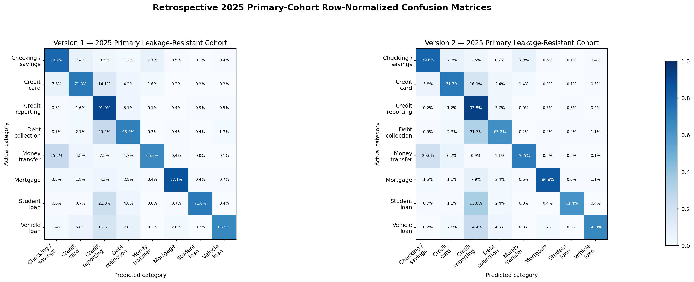
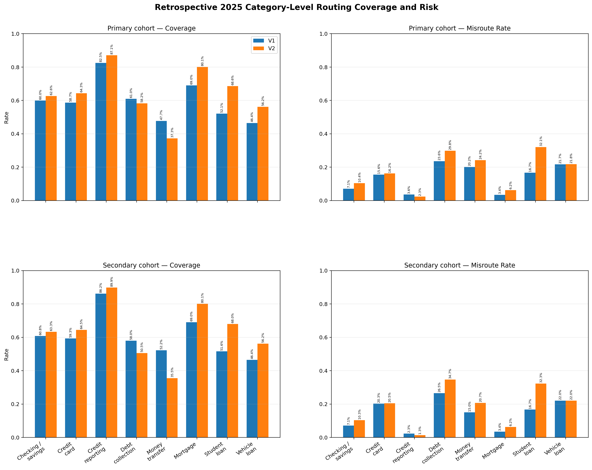
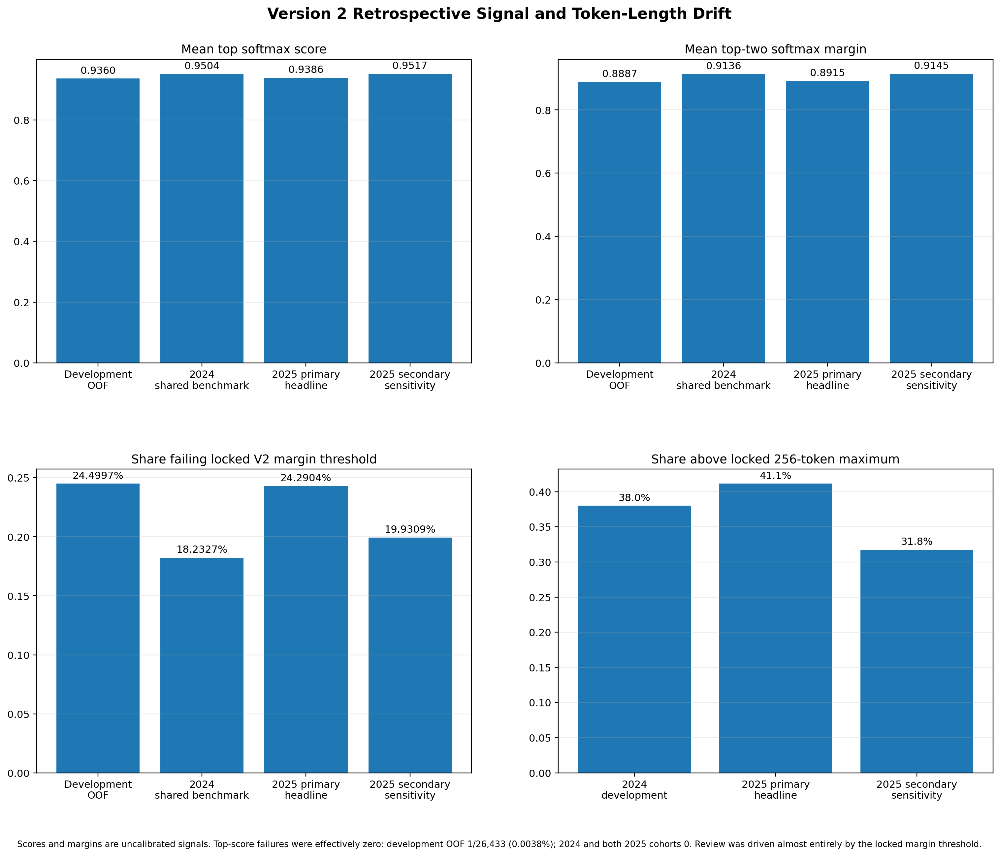

# Version 2 Retrospective 2025 V1-versus-V2 Comparison

## Status and Scope

The locked retrospective comparison is complete. It compares the frozen Version 1 TF-IDF + Linear SVM benchmark with the frozen Version 2 DistilBERT challenger on the existing 2025 cohorts. This is not a new untouched Version 2 holdout: Version 1 had already been evaluated on the same 2025 sample.

The 30,156-row primary leakage-resistant cohort is the headline result. The 49,225-row secondary operational cohort retains repeated texts and cross-year overlap and is reported only as a sensitivity view. Neither model was trained, fine-tuned, calibrated, reselected, or otherwise changed; both routing policies remained locked. No independently temporally validated Version 2 champion is declared.

## Protocol and Frozen-Artifact Evidence

- Protocol: [`v2_2025_retrospective_protocol.md`](v2_2025_retrospective_protocol.md)
- Protocol commit: `48479f389fcd06bfdf4cf3036026f86a8ecb51c7`
- Protocol SHA-256: `22d6989adfe877b862e3609c5a074955b9c7ced9037a2f20102eb361ed8b19fd`
- Execution commit: `48479f389fcd06bfdf4cf3036026f86a8ecb51c7`
- 2025 source SHA-256: `b59d7842e786f00d6be26b7980a42f67474acb9040db293ddd3641204d25eb3a`
- Version 1 artifact SHA-256: `4514e7e49e305e408e2eaaf296d8607b33e9320547685339eff263e4dda0c94a`
- Version 2 model SHA-256: `e05900579f16e96d75df968cedb71b2b2fde3aae95f1bf73dbe7147306287c23`
- Version 2 tokenizer SHA-256: `8b79639ec74b46604e730f505186eaafb1006d2fd00f2c4930d168bb7f894680`
- Version 2 routing-policy SHA-256: `9ca16a8533f26f8e00fd9d57c654af66fa78e21880f7fa7783a9d1adf964d818`

Version 1 used its locked top-score and margin thresholds of `0.08` and `0.73`. Version 2 used its development-OOF-selected thresholds of `0.22` and `0.91`. Both conditions were inclusive and had to pass for automatic routing. Linear SVM decision scores and transformer softmax scores and margins are uncalibrated model signals, not calibrated probabilities or real-world confidence.

## Data Integrity and Cohorts

The fingerprinted 2025 source remained unchanged at 50,000 rows and 73,806,040 bytes. Required values were complete, and the same canonical eight-category order was used for both models.

| Cohort-flow stage | Excluded | Remaining |
|---|---:|---:|
| Raw 2025 source | 0 | 50,000 |
| Restrict to locked eight-category scope | 775 | 49,225 |
| Exclude normalized-text overlap with either locked 2024 partition | 5,579 | 43,646 |
| Exclude remaining conflicting-label rows | 1,301 | 42,345 |
| Remove repeated same-label extras | 12,189 | 30,156 |

The primary cohort contains one row per normalized-text hash, no conflicting-label groups, no normalized-text overlap with either locked 2024 partition, and all eight categories. The secondary cohort preserves all 49,225 otherwise eligible locked-scope rows.

## Overall Classification Results

| Cohort | Model | Rows | Correct | Incorrect | Accuracy | Macro precision | Macro recall | Macro F1 | Weighted precision | Weighted recall | Weighted F1 |
|---|---|---:|---:|---:|---:|---:|---:|---:|---:|---:|---:|
| **Primary headline** | V1 | 30,156 | 25,075 | 5,081 | 0.8315 | 0.7577 | 0.7508 | 0.7527 | 0.8312 | 0.8315 | 0.8306 |
| **Primary headline** | V2 | 30,156 | 25,342 | 4,814 | **0.8404** | **0.7899** | 0.7392 | **0.7620** | **0.8364** | **0.8404** | **0.8364** |
| Secondary sensitivity | V1 | 49,225 | 43,175 | 6,050 | **0.8771** | 0.7573 | **0.7592** | 0.7569 | **0.8770** | **0.8771** | **0.8766** |
| Secondary sensitivity | V2 | 49,225 | 43,079 | 6,146 | 0.8751 | **0.7880** | 0.7351 | **0.7586** | 0.8694 | 0.8751 | 0.8701 |

On the primary cohort, Version 2 improved Accuracy by 0.0089, Macro F1 by 0.0093, and Weighted F1 by 0.0057 relative to Version 1. On the secondary cohort, Version 2 improved Macro F1 by 0.0018 but had 0.0020 lower Accuracy and 0.0065 lower Weighted F1. The dominant credit-reporting category strongly influences weighted metrics.

Version 2's small Macro F1 gains were precision-led rather than recall-led. Primary macro precision increased from 0.7577 to 0.7899 while macro recall decreased from 0.7508 to 0.7392; secondary macro precision increased from 0.7573 to 0.7880 while macro recall decreased from 0.7592 to 0.7351. Macro F1 therefore increased slightly even as average category recall fell, consistent with the documented recall declines for debt collection and student loan.

## Per-Category Classification

### Primary headline cohort

| Category | Support | V1 precision | V1 recall | V1 F1 | V2 precision | V2 recall | V2 F1 | V2 - V1 F1 |
|---|---:|---:|---:|---:|---:|---:|---:|---:|
| Checking or savings account | 2,165 | 0.7115 | 0.7917 | 0.7495 | 0.7707 | 0.7963 | 0.7833 | +0.0338 |
| Credit card | 2,253 | 0.6977 | 0.7182 | 0.7078 | 0.7304 | 0.7168 | 0.7236 | +0.0158 |
| Credit reporting or other personal consumer reports | 17,843 | 0.8990 | 0.9097 | 0.9043 | 0.8798 | 0.9379 | 0.9079 | +0.0036 |
| Debt collection | 4,484 | 0.7301 | 0.6889 | 0.7089 | 0.7736 | 0.6325 | 0.6960 | -0.0129 |
| Money transfer, virtual currency, or money service | 1,507 | 0.8105 | 0.6530 | 0.7233 | 0.8279 | 0.7054 | 0.7617 | +0.0384 |
| Mortgage | 719 | 0.8248 | 0.8707 | 0.8471 | 0.8579 | 0.8484 | 0.8531 | +0.0060 |
| Student loan | 541 | 0.6821 | 0.7098 | 0.6957 | 0.7378 | 0.6137 | 0.6700 | -0.0257 |
| Vehicle loan or lease | 644 | 0.7063 | 0.6646 | 0.6848 | 0.7413 | 0.6630 | 0.7000 | +0.0152 |

Version 2's largest primary F1 gains were money transfer (+0.0384) and checking or savings (+0.0338). Student loan (-0.0257) and debt collection (-0.0129) declined. Small supports make category estimates less stable.

### Secondary sensitivity cohort

| Category | Support | V1 precision | V1 recall | V1 F1 | V2 precision | V2 recall | V2 F1 | V2 - V1 F1 |
|---|---:|---:|---:|---:|---:|---:|---:|---:|
| Checking or savings account | 2,216 | 0.7146 | 0.7942 | 0.7523 | 0.7743 | 0.7987 | 0.7863 | +0.0340 |
| Credit card | 2,369 | 0.6750 | 0.6935 | 0.6842 | 0.7093 | 0.6830 | 0.6959 | +0.0117 |
| Credit reporting or other personal consumer reports | 35,215 | 0.9350 | 0.9406 | 0.9378 | 0.9119 | 0.9586 | 0.9346 | -0.0032 |
| Debt collection | 5,664 | 0.7241 | 0.6854 | 0.7042 | 0.7438 | 0.5576 | 0.6373 | -0.0669 |
| Money transfer, virtual currency, or money service | 1,848 | 0.8502 | 0.7154 | 0.7770 | 0.8639 | 0.7592 | 0.8082 | +0.0312 |
| Mortgage | 720 | 0.8185 | 0.8708 | 0.8439 | 0.8545 | 0.8486 | 0.8516 | +0.0077 |
| Student loan | 547 | 0.6549 | 0.7112 | 0.6819 | 0.7179 | 0.6143 | 0.6621 | -0.0198 |
| Vehicle loan or lease | 646 | 0.6859 | 0.6625 | 0.6740 | 0.7287 | 0.6610 | 0.6932 | +0.0192 |

## Selective-Routing Results

| Cohort | Model | Auto-routed | Human review | Coverage | Review rate | Correct routes | Incorrect routes | Routed accuracy | Misroute rate |
|---|---|---:|---:|---:|---:|---:|---:|---:|---:|
| **Primary headline** | V1 | 21,867 | 8,289 | 0.7251 | 0.2749 | 20,125 | 1,742 | **0.9203** | **0.0797** |
| **Primary headline** | V2 | 22,831 | 7,325 | **0.7571** | **0.2429** | 20,945 | 1,886 | 0.9174 | 0.0826 |
| Secondary sensitivity | V1 | 38,442 | 10,783 | 0.7809 | 0.2191 | 36,227 | 2,215 | 0.9424 | 0.0576 |
| Secondary sensitivity | V2 | 39,414 | 9,811 | **0.8007** | **0.1993** | 37,171 | 2,243 | **0.9431** | **0.0569** |

Version 2 routed 964 more primary rows, raising coverage by 0.0320 and reducing the review rate by the same amount. That came with 144 more routed errors: routed accuracy was 0.0029 lower and the misroute rate was 0.0029 higher than Version 1. On the secondary sensitivity cohort, Version 2 coverage was 0.0197 higher and its misroute rate was 0.0007 lower.

Version 1 primary review reasons were 5,514 rows failing both thresholds, 2,460 failing margin only, and 315 failing top score only. Version 2 sent 7,325 primary rows to review because of the margin threshold; no primary row failed its top-score threshold. On the secondary cohort, Version 1 review reasons were 7,048 failing both, 3,318 failing margin only, and 417 failing top score only; Version 2's 9,811 review rows all failed margin only.

### Primary category-level routing risk

| Category | Model | Support | Auto-routed | Coverage | Review rate | Routed accuracy | Misroute rate |
|---|---|---:|---:|---:|---:|---:|---:|
| Checking or savings account | V1 | 2,165 | 1,298 | 0.5995 | 0.4005 | 0.9291 | 0.0709 |
| Checking or savings account | V2 | 2,165 | 1,356 | 0.6263 | 0.3737 | 0.8960 | 0.1040 |
| Credit card | V1 | 2,253 | 1,323 | 0.5872 | 0.4128 | 0.8443 | 0.1557 |
| Credit card | V2 | 2,253 | 1,449 | 0.6431 | 0.3569 | 0.8378 | 0.1622 |
| Credit reporting or other personal consumer reports | V1 | 17,843 | 14,717 | 0.8248 | 0.1752 | 0.9643 | 0.0357 |
| Credit reporting or other personal consumer reports | V2 | 17,843 | 15,544 | 0.8712 | 0.1288 | 0.9768 | 0.0232 |
| Debt collection | V1 | 4,484 | 2,733 | 0.6095 | 0.3905 | 0.7644 | 0.2356 |
| Debt collection | V2 | 4,484 | 2,611 | 0.5823 | 0.4177 | 0.7016 | 0.2984 |
| Money transfer, virtual currency, or money service | V1 | 1,507 | 719 | 0.4771 | 0.5229 | 0.7983 | 0.2017 |
| Money transfer, virtual currency, or money service | V2 | 1,507 | 562 | 0.3729 | 0.6271 | 0.7580 | 0.2420 |
| Mortgage | V1 | 719 | 496 | 0.6898 | 0.3102 | 0.9657 | 0.0343 |
| Mortgage | V2 | 719 | 576 | 0.8011 | 0.1989 | 0.9375 | 0.0625 |
| Student loan | V1 | 541 | 282 | 0.5213 | 0.4787 | 0.8333 | 0.1667 |
| Student loan | V2 | 541 | 371 | 0.6858 | 0.3142 | 0.6792 | 0.3208 |
| Vehicle loan or lease | V1 | 644 | 299 | 0.4643 | 0.5357 | 0.7826 | 0.2174 |
| Vehicle loan or lease | V2 | 644 | 362 | 0.5621 | 0.4379 | 0.7818 | 0.2182 |

Version 2 improved credit-reporting routing risk, but debt collection and student loan had materially higher primary misroute rates. Money transfer also had lower coverage and higher misroute risk. These category results argue for human oversight and do not establish approved category risk limits.

### Secondary category-level routing sensitivity

| Category | Model | Support | Auto-routed | Coverage | Review rate | Routed accuracy | Misroute rate |
|---|---|---:|---:|---:|---:|---:|---:|
| Checking or savings account | V1 | 2,216 | 1,347 | 0.6079 | 0.3921 | 0.9295 | 0.0705 |
| Checking or savings account | V2 | 2,216 | 1,403 | 0.6331 | 0.3669 | 0.8967 | 0.1033 |
| Credit card | V1 | 2,369 | 1,405 | 0.5931 | 0.4069 | 0.7972 | 0.2028 |
| Credit card | V2 | 2,369 | 1,528 | 0.6450 | 0.3550 | 0.7952 | 0.2048 |
| Credit reporting or other personal consumer reports | V1 | 35,215 | 30,361 | 0.8622 | 0.1378 | 0.9773 | 0.0227 |
| Credit reporting or other personal consumer reports | V2 | 35,215 | 31,653 | 0.8988 | 0.1012 | 0.9868 | 0.0132 |
| Debt collection | V1 | 5,664 | 3,285 | 0.5800 | 0.4200 | 0.7349 | 0.2651 |
| Debt collection | V2 | 5,664 | 2,862 | 0.5053 | 0.4947 | 0.6527 | 0.3473 |
| Money transfer, virtual currency, or money service | V1 | 1,848 | 965 | 0.5222 | 0.4778 | 0.8497 | 0.1503 |
| Money transfer, virtual currency, or money service | V2 | 1,848 | 656 | 0.3550 | 0.6450 | 0.7927 | 0.2073 |
| Mortgage | V1 | 720 | 497 | 0.6903 | 0.3097 | 0.9658 | 0.0342 |
| Mortgage | V2 | 720 | 577 | 0.8014 | 0.1986 | 0.9376 | 0.0624 |
| Student loan | V1 | 547 | 282 | 0.5155 | 0.4845 | 0.8333 | 0.1667 |
| Student loan | V2 | 547 | 372 | 0.6801 | 0.3199 | 0.6774 | 0.3226 |
| Vehicle loan or lease | V1 | 646 | 300 | 0.4644 | 0.5356 | 0.7800 | 0.2200 |
| Vehicle loan or lease | V2 | 646 | 363 | 0.5619 | 0.4381 | 0.7796 | 0.2204 |

## Signed Comparisons

Temporal differences use full-precision 2024 metrics recomputed from the fingerprinted Issue #41 final-test output artifact (`86e22f40174b3c8f897ad64bf0888064f1f377ef0f7b884b0e8b326c7fae51d2`) and full-precision 2025 metrics; values are rounded only for display.

### Primary 2025 minus shared 2024 reference

| Model | Accuracy | Macro F1 | Weighted F1 | Coverage | Review rate | Routed accuracy | Misroute rate |
|---|---:|---:|---:|---:|---:|---:|---:|
| V1 | -0.0397 | -0.0145 | -0.0408 | -0.0453 | +0.0453 | -0.0300 | +0.0300 |
| V2 | -0.0478 | -0.0330 | -0.0495 | -0.0606 | +0.0606 | -0.0302 | +0.0302 |

Both frozen models weakened on the primary retrospective cohort relative to their shared 2024 benchmark. Version 2's temporal changes were slightly larger for all three headline classification metrics and routing coverage.

### V2 minus V1 in 2025

| Cohort | Accuracy | Macro F1 | Weighted F1 | Coverage | Review rate | Routed accuracy | Misroute rate |
|---|---:|---:|---:|---:|---:|---:|---:|
| Primary headline | +0.0089 | +0.0093 | +0.0057 | +0.0320 | -0.0320 | -0.0029 | +0.0029 |
| Secondary sensitivity | -0.0020 | +0.0018 | -0.0065 | +0.0197 | -0.0197 | +0.0007 | -0.0007 |

### Secondary minus primary sensitivity effect

| Model | Accuracy | Macro F1 | Weighted F1 | Coverage | Review rate | Routed accuracy | Misroute rate |
|---|---:|---:|---:|---:|---:|---:|---:|
| V1 | +0.0456 | +0.0042 | +0.0460 | +0.0558 | -0.0558 | +0.0220 | -0.0220 |
| V2 | +0.0348 | -0.0033 | +0.0337 | +0.0436 | -0.0436 | +0.0257 | -0.0257 |

The sensitivity results are more favorable on majority-influenced metrics and routing risk because the secondary cohort retains repeated text and prior-year overlap. They do not replace the leakage-resistant headline conclusion.

## Version 2 Signal Drift

Development OOF signals came from the five fold models. The 2024 benchmark and both 2025 cohorts used the frozen final model. These distributions are descriptive and cannot establish causality or statistical significance.

| Cohort | Top-score mean | Top-score std | Top-score median | Top p05 / p95 | Margin mean | Margin std | Margin median | Margin p05 / p95 | Fail top (count / share) | Fail margin (count / share) | Fail both (count / share) |
|---|---:|---:|---:|---:|---:|---:|---:|---:|---:|---:|---:|
| Development OOF | 0.9360 | 0.1191 | 0.9874 | 0.6335 / 0.9976 | 0.8887 | 0.2088 | 0.9801 | 0.3387 / 0.9965 | 1 / 26,433 (0.0038%) | 6,476 / 26,433 (24.4997%) | 1 / 26,433 (0.0038%) |
| 2024 frozen-model benchmark | 0.9504 | 0.1079 | 0.9924 | 0.6735 / 0.9985 | 0.9136 | 0.1902 | 0.9885 | 0.4173 / 0.9978 | 0 / 6,609 (0.0000%) | 1,205 / 6,609 (18.2327%) | 0 / 6,609 (0.0000%) |
| **2025 primary headline** | 0.9386 | 0.1172 | 0.9901 | 0.6342 / 0.9984 | 0.8915 | 0.2097 | 0.9845 | 0.3370 / 0.9976 | 0 / 30,156 (0.0000%) | 7,325 / 30,156 (24.2904%) | 0 / 30,156 (0.0000%) |
| 2025 secondary sensitivity | 0.9517 | 0.1036 | 0.9929 | 0.7074 / 0.9984 | 0.9145 | 0.1855 | 0.9888 | 0.4652 / 0.9976 | 0 / 49,225 (0.0000%) | 9,811 / 49,225 (19.9309%) | 0 / 49,225 (0.0000%) |

The primary top-score and margin distributions shifted lower than the 2024 frozen-model benchmark. Two-sample KS statistics were 0.0806 for top score and 0.0810 for margin. The secondary shifts were smaller at 0.0507 and 0.0508. Top-score failures were effectively zero: the development OOF set had one failure in 26,433 rows (0.0038%), and the 2024 benchmark and both 2025 cohorts had none. Review behavior was therefore driven almost entirely by the locked margin threshold. All signals are uncalibrated, and these are descriptive distribution distances, not significance tests.

## Token-Length and Truncation Drift

Token lengths include special tokens and use no padding or truncation for the audit. The locked 256-token limit was not changed.

| Cohort | Min | Mean | Population std | Median | p75 | p90 | p95 | p99 | Max | At/below 256 | Above 256 | Above 512 |
|---|---:|---:|---:|---:|---:|---:|---:|---:|---:|---:|---:|---:|
| 2024 development | 4 | 289.02 | 386.82 | 187 | 352 | 601 | 837.4 | 1,784 | 8,136 | 61.99% | 38.01% | 13.42% |
| **2025 primary headline** | 9 | 299.26 | 340.18 | 207 | 377 | 636 | 855.0 | 1,631.45 | 7,143 | 58.85% | 41.15% | 15.21% |
| 2025 secondary sensitivity | 9 | 256.25 | 306.14 | 178 | 313 | 553 | 770.8 | 1,425 | 7,143 | 68.25% | 31.75% | 11.56% |

The primary cohort had longer narratives and a higher residual truncation share than 2024 development. The secondary cohort was shorter and had a lower truncation share. Truncation is a material information-loss and compute trade-off, but these retrospective results cannot be used to change the frozen tokenizer or maximum length.

## Business Interpretation and Recommendation

The 2025 evidence is mixed. Version 2 remains a useful frozen challenger because it produced slightly higher primary Accuracy, Macro F1, and Weighted F1 and higher coverage than Version 1. However, its primary routed accuracy was slightly lower, its aggregate misroute rate was slightly higher, and its debt-collection and student-loan routing risks were materially higher. Its secondary results were broadly comparable to Version 1 rather than decisively better. Both models degraded versus their shared 2024 benchmark.

This evidence is consistent with continuing to study Version 2, but it weakens the case for promotion based on the 2024 benchmark alone. **Retain Version 1 as the temporally validated benchmark and Version 2 as the frozen transformer challenger pending a new untouched temporal period.** Full-year 2026 data is the planned independent promotion evidence. A project champion would still not be a production-approved model.

## Limitations and Governance Boundaries

- The 2025 data is a sampled CFPB public dataset, not the complete operational population or private institution data.
- The evaluation covers eight locked categories, with imbalanced and sometimes small supports.
- The secondary cohort retains repeated texts and cross-year overlap and is only a sensitivity view.
- Version 2 truncates narratives beyond 256 tokens; 41.15% of primary narratives exceeded that limit.
- Softmax and decision-score signals are not calibrated probabilities.
- Routing thresholds are project assumptions, not approved production standards.
- Results are descriptive and do not establish causality, statistical significance, fairness, production readiness, deployment readiness, regulatory approval, cost savings, or workload reduction.
- Complaint narratives may contain sensitive information. Row-level labels, predictions, logits, scores, margins, hashes, cohort membership, and token lengths remain local and Git-ignored.
- The 2025 sample is exhausted as unbiased evidence. It must not influence model, tokenizer, training, calibration, threshold, or champion decisions.
- Independent Version 2 temporal promotion evidence requires a new untouched period.

## Reproducibility

- Executed notebook: [`../notebooks/11_v2_2025_retrospective_comparison.ipynb`](../notebooks/11_v2_2025_retrospective_comparison.ipynb)
- Version 2 model manifest: [`v2_model_manifest.md`](v2_model_manifest.md)
- Version 2 model card: [`v2_model_card.md`](v2_model_card.md)
- Local machine-readable summary and row-level outputs remain under `models/v1_v2_2025_retrospective/` and are Git-ignored.
- Evaluation used Python 3.11.15, PyTorch 2.9.1+cu126, Transformers 4.57.6, scikit-learn 1.9.0, CUDA, and an NVIDIA GeForce GTX 1650.
