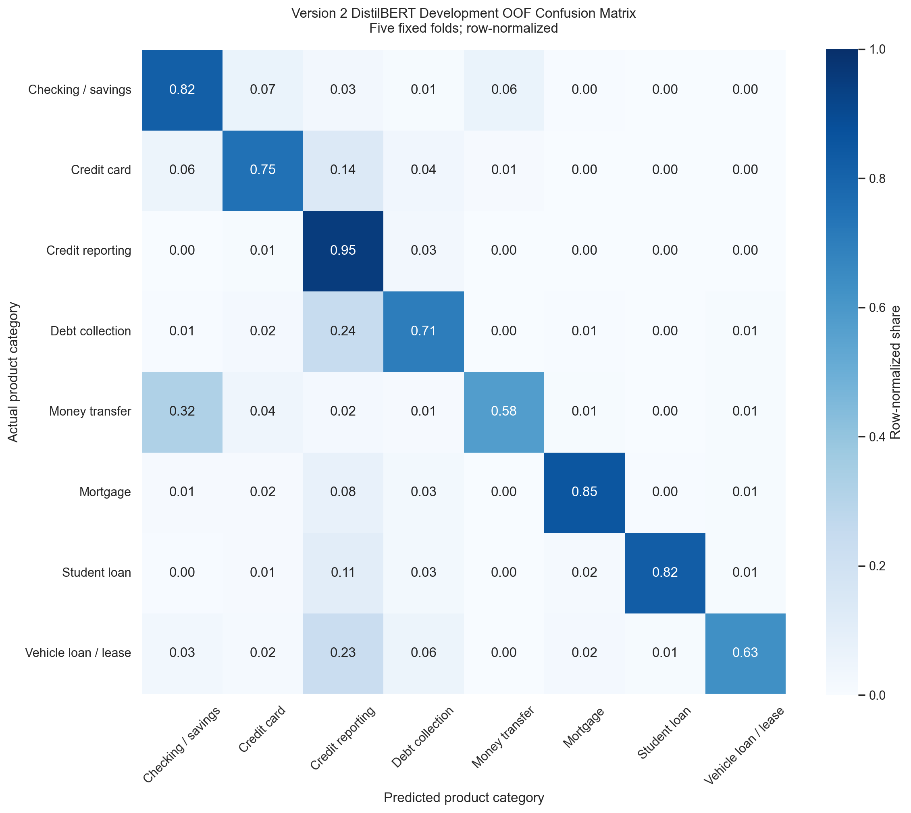

# Version 2 DistilBERT Development Results

## Status and Scope

The Version 2 DistilBERT challenger completed the precommitted five-fold
development experiment on all 26,433 locked 2024 development rows. Each row
received exactly one out-of-fold (OOF) prediction from a model that did not
train on that row. These are development-only results: the 6,609-row final
internal-test reference was used only to verify the exclusion boundary and was
not tokenized, scored, or evaluated. No 2025 or 2026 data was loaded.

The experiment does not establish a project champion or production readiness.
Matched Version 1-versus-Version 2 evaluation is deferred to Issue #41.

## Locked Configuration

| Setting | Value |
|---|---:|
| Base model and tokenizer | `distilbert/distilbert-base-uncased` |
| Exact revision | `12040accade4e8a0f71eabdb258fecc2e7e948be` |
| Architecture | `DistilBertForSequenceClassification` |
| Classes | 8, in the canonical locked order |
| Maximum token length | 256 |
| Random seed | 42 |
| Learning rate | `2e-5` |
| Weight decay | `0.01` |
| Maximum epochs | 4 |
| Training batch size | 8 |
| Gradient accumulation | 2 |
| Effective batch size | 16 |
| Evaluation batch size | 16 |
| Precision | FP16 |
| Optimizer | PyTorch AdamW |
| Warmup / scheduler | 10% / linear |
| Gradient clipping | `1.0` |
| Checkpoint metric | Validation Macro F1 |
| Early stopping | Patience 1, threshold 0 |

The primary GPU configuration completed every fold. The permitted batch-size
fallback was not required. External reporting services were disabled.

## Fold Results

| Fold | Train rows | Validation rows | Best epoch | Accuracy | Macro F1 | Weighted F1 | Training time (min) | Peak allocated (MiB) | Peak reserved (MiB) | Configuration |
|---:|---:|---:|---:|---:|---:|---:|---:|---:|---:|---|
| 0 | 21,146 | 5,287 | 4 | 0.8837 | 0.7868 | 0.8819 | 302.49 | 1,587.9 | 1,746.0 | Primary |
| 1 | 21,146 | 5,287 | 2 | 0.8795 | 0.7809 | 0.8771 | 227.68 | 1,583.5 | 1,744.0 | Primary |
| 2 | 21,146 | 5,287 | 4 | 0.8827 | 0.7832 | 0.8806 | 301.07 | 1,584.3 | 1,748.0 | Primary |
| 3 | 21,147 | 5,286 | 4 | 0.8727 | 0.7697 | 0.8710 | 298.40 | 1,583.8 | 1,748.0 | Primary |
| 4 | 21,147 | 5,286 | 4 | 0.8801 | 0.7881 | 0.8773 | 301.35 | 1,585.9 | 1,758.0 | Primary |

The five fold-best integer epochs were `[4, 2, 4, 4, 4]`. Their integer
median is 4, which was recorded before final full-development training.
Reported GPU values are PyTorch peak allocator measurements.

## Aggregate Development OOF Results

| Metric | Result |
|---|---:|
| Rows with exactly one OOF prediction | 26,433 |
| Accuracy | 0.8797 |
| Macro precision | 0.8034 |
| Macro recall | 0.7636 |
| Macro F1 | 0.7820 |
| Weighted precision | 0.8766 |
| Weighted recall | 0.8797 |
| Weighted F1 | 0.8776 |

## Per-Category OOF Results

| Category | Precision | Recall | F1 | Support |
|---|---:|---:|---:|---:|
| Checking or savings account | 0.7832 | 0.8184 | 0.8005 | 1,713 |
| Credit card | 0.7918 | 0.7465 | 0.7685 | 2,028 |
| Credit reporting or other personal consumer reports | 0.9257 | 0.9523 | 0.9388 | 17,311 |
| Debt collection | 0.7714 | 0.7056 | 0.7370 | 3,128 |
| Money transfer, virtual currency, or money service | 0.6844 | 0.5759 | 0.6255 | 580 |
| Mortgage | 0.8618 | 0.8545 | 0.8582 | 708 |
| Student loan | 0.8827 | 0.8247 | 0.8527 | 502 |
| Vehicle loan or lease | 0.7264 | 0.6307 | 0.6751 | 463 |

## Confusion-Matrix Interpretation

The row-normalized matrix uses the locked class order and aggregate OOF
predictions only. Credit reporting remained the dominant category and had
95.23% recall. The largest recurring error directions included debt collection
to credit reporting (24.49% of debt-collection support), vehicle loan or lease
to credit reporting (23.11%), and money transfer to checking or savings
(32.41%). The smaller money-transfer and vehicle-loan supports make their
category estimates less stable than the dominant credit-reporting result.

## Training and Artifact Controls

- Every development row received exactly one finite eight-class OOF logit
  vector and one predicted label.
- All five train/validation fold pairs had zero normalized-text group overlap.
- Row-level OOF labels, logits, fold assignments, top softmax scores, and
  top-two margins were saved only under the Git-ignored local `models/`
  directory.
- Completed-fold reuse required matching source, model, tokenizer, fold,
  configuration, label-map, token-length, row-count, and index fingerprints.
- Unnecessary fold checkpoints were removed after validated outputs were
  preserved.

## Limitations

The locked maximum length of 256 truncates 38.0055% of development narratives.
This is a material information-loss and compute trade-off when interpreting
Version 2 results. The eight-category sample is imbalanced, and the dominant
credit-reporting category strongly influences weighted metrics. Softmax scores
and score margins are uncalibrated model signals, not calibrated probabilities.
No routing policy was selected in this issue.

These development OOF results support later matched evaluation; they do not
demonstrate temporal validation, deployment readiness, cost savings, workload
reduction, or regulatory approval.
